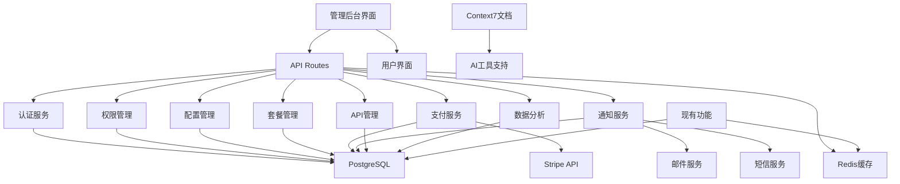

# 后台管理系统设计文档

## 概述

基于需求文档，设计一个全面的后台管理系统，满足所有20个需求。系统采用现有技术栈，遵循简单实用原则，确保与现有功能完全兼容。

## 完整架构设计

### 技术栈（使用现有技术）

**前端：**
- Next.js 14 (现有)
- React 18 + TypeScript (现有)
- Tailwind CSS (现有)
- NextAuth.js (现有Gmail OAuth)

**后端：**
- Next.js API Routes (现有)
- PostgreSQL + Prisma (现有)
- Redis (现有)
- Stripe (新增)

**部署：**
- Docker (现有)
- GitHub Actions (现有)
- 现有环境配置

### 完整系统架构



## 核心组件设计

### 1. 完整数据模型

```typescript
// 扩展现有User模型
interface User {
  id: string
  email: string
  name?: string
  role: 'USER' | 'ADMIN' | 'SUPER_ADMIN'
  tokenBalance: number
  stripeCustomerId?: string
  isActive: boolean
  lastLoginAt?: Date
  createdAt: Date
  updatedAt: Date
}

// 订阅管理
interface Subscription {
  id: string
  userId: string
  planId: string
  stripeSubscriptionId?: string
  status: 'active' | 'canceled' | 'past_due' | 'trialing'
  currentPeriodStart: Date
  currentPeriodEnd: Date
  cancelAtPeriodEnd: boolean
  createdAt: Date
  updatedAt: Date
}

// 套餐管理
interface Plan {
  id: string
  name: string
  displayName: string
  description: string
  price: number
  billingPeriod: 'monthly' | 'yearly'
  tokenQuota: number
  features: string[]
  rateLimit: number
  stripePriceId?: string
  isActive: boolean
  createdAt: Date
  updatedAt: Date
}

// 系统配置
interface SystemConfig {
  id: string
  key: string
  value: string
  type: 'string' | 'number' | 'boolean' | 'json'
  description: string
  isHotReloadable: boolean
  updatedBy: string
  updatedAt: Date
}

// 通知管理
interface Notification {
  id: string
  type: 'email' | 'sms'
  template: string
  subject?: string
  content: string
  recipients: string[]
  status: 'pending' | 'sent' | 'failed'
  scheduledAt?: Date
  sentAt?: Date
  createdBy: string
  createdAt: Date
}

// API监控
interface ApiUsage {
  id: string
  userId: string
  endpoint: string
  method: string
  statusCode: number
  responseTime: number
  tokenConsumed: number
  timestamp: Date
}

// 用户行为分析
interface UserActivity {
  id: string
  userId: string
  action: string
  resource: string
  metadata: Record<string, any>
  timestamp: Date
}

// 第三方服务配置
interface ServiceConfig {
  id: string
  serviceName: string
  config: Record<string, any>
  status: 'active' | 'inactive' | 'error'
  lastChecked: Date
  createdAt: Date
  updatedAt: Date
}
```

### 2. 完整API设计

```typescript
// 用户管理API
interface UserAPI {
  'GET /api/admin/users': { users: User[]; total: number; stats: UserStats }
  'GET /api/admin/users/[id]': { user: User; activities: UserActivity[] }
  'PUT /api/admin/users/[id]/role': { body: { role: string }; response: User }
  'PUT /api/admin/users/[id]/status': { body: { isActive: boolean }; response: User }
  'GET /api/admin/users/analytics': { analytics: UserAnalytics }
}

// 套餐管理API
interface PlanAPI {
  'GET /api/admin/plans': { plans: Plan[] }
  'POST /api/admin/plans': { body: Omit<Plan, 'id' | 'createdAt' | 'updatedAt'>; response: Plan }
  'PUT /api/admin/plans/[id]': { body: Partial<Plan>; response: Plan }
  'DELETE /api/admin/plans/[id]': { response: { success: boolean } }
}

// 订阅管理API
interface SubscriptionAPI {
  'GET /api/admin/subscriptions': { subscriptions: Subscription[]; stats: SubscriptionStats }
  'PUT /api/admin/subscriptions/[id]/cancel': { response: Subscription }
  'POST /api/admin/subscriptions/[id]/refund': { body: { amount?: number }; response: { success: boolean } }
}

// 配置管理API
interface ConfigAPI {
  'GET /api/admin/config': { configs: SystemConfig[] }
  'PUT /api/admin/config/[key]': { body: { value: string }; response: SystemConfig }
  'POST /api/admin/config/reload': { response: { success: boolean } }
  'GET /api/admin/config/test-connections': { response: ServiceStatus[] }
}

// 通知管理API
interface NotificationAPI {
  'GET /api/admin/notifications': { notifications: Notification[] }
  'POST /api/admin/notifications': { body: Omit<Notification, 'id' | 'createdAt'>; response: Notification }
  'POST /api/admin/notifications/send-bulk': { body: BulkNotificationRequest; response: { success: boolean } }
  'GET /api/admin/notifications/templates': { templates: NotificationTemplate[] }
}

// API管理API
interface ApiManagementAPI {
  'GET /api/admin/api-usage': { usage: ApiUsage[]; stats: ApiStats }
  'GET /api/admin/api-limits': { limits: ApiLimit[] }
  'PUT /api/admin/api-limits/[userId]': { body: ApiLimit; response: ApiLimit }
  'GET /api/admin/api-health': { health: ApiHealthStatus[] }
}

// 数据分析API
interface AnalyticsAPI {
  'GET /api/admin/analytics/overview': { overview: SystemOverview }
  'GET /api/admin/analytics/users': { analytics: UserAnalytics }
  'GET /api/admin/analytics/revenue': { analytics: RevenueAnalytics }
  'GET /api/admin/analytics/performance': { analytics: PerformanceAnalytics }
  'GET /api/admin/analytics/export': { response: Blob }
}

// 第三方服务API
interface ServiceAPI {
  'GET /api/admin/services': { services: ServiceConfig[] }
  'PUT /api/admin/services/[name]': { body: Partial<ServiceConfig>; response: ServiceConfig }
  'POST /api/admin/services/[name]/test': { response: ServiceTestResult }
  'GET /api/admin/services/status': { status: ServiceStatus[] }
}
```

### 3. 完整页面组件

```typescript
// 管理后台完整页面结构
interface AdminPages {
  '/admin': DashboardPage                    // 系统概览
  '/admin/users': UserManagementPage         // 用户管理
  '/admin/users/[id]': UserDetailPage        // 用户详情
  '/admin/users/analytics': UserAnalyticsPage // 用户分析
  '/admin/plans': PlanManagementPage         // 套餐管理
  '/admin/subscriptions': SubscriptionPage   // 订阅管理
  '/admin/config': ConfigManagementPage      // 配置管理
  '/admin/notifications': NotificationPage   // 通知管理
  '/admin/api': ApiManagementPage           // API管理
  '/admin/analytics': AnalyticsPage         // 数据分析
  '/admin/services': ServiceConfigPage      // 第三方服务
  '/admin/performance': PerformancePage     // 性能监控
  '/pricing': PricingPage                   // 价格页面（公开）
}

// 权限管理系统
interface PermissionSystem {
  roles: {
    USER: string[]
    ADMIN: string[]
    SUPER_ADMIN: string[]
  }
  permissions: {
    'users.read': boolean
    'users.write': boolean
    'plans.read': boolean
    'plans.write': boolean
    'config.read': boolean
    'config.write': boolean
    'analytics.read': boolean
    'services.read': boolean
    'services.write': boolean
  }
}

// 权限检查函数
function hasPermission(user: User, permission: string): boolean
function requirePermission(permission: string): MiddlewareFunction
function requireRole(role: string): MiddlewareFunction
```

## 完整数据库设计

```prisma
// 扩展现有User模型
model User {
  id               String    @id @default(cuid())
  email            String    @unique
  name             String?
  role             String    @default("USER")
  tokenBalance     Int       @default(0)
  stripeCustomerId String?   @unique
  isActive         Boolean   @default(true)
  lastLoginAt      DateTime?
  createdAt        DateTime  @default(now())
  updatedAt        DateTime  @updatedAt

  // 关联
  subscription     Subscription?
  activities       UserActivity[]
  apiUsages        ApiUsage[]
  notifications    Notification[]

  @@map("users")
}

// 订阅管理
model Subscription {
  id                   String    @id @default(cuid())
  userId               String    @unique
  planId               String
  stripeSubscriptionId String?   @unique
  status               String    @default("active")
  currentPeriodStart   DateTime
  currentPeriodEnd     DateTime
  cancelAtPeriodEnd    Boolean   @default(false)
  createdAt            DateTime  @default(now())
  updatedAt            DateTime  @updatedAt

  user User @relation(fields: [userId], references: [id])
  plan Plan @relation(fields: [planId], references: [id])

  @@map("subscriptions")
}

// 套餐管理
model Plan {
  id            String  @id @default(cuid())
  name          String  @unique
  displayName   String
  description   String
  price         Int
  billingPeriod String
  tokenQuota    Int
  features      Json
  rateLimit     Int     @default(100)
  stripePriceId String? @unique
  isActive      Boolean @default(true)
  createdAt     DateTime @default(now())
  updatedAt     DateTime @updatedAt

  subscriptions Subscription[]

  @@map("plans")
}

// 系统配置
model SystemConfig {
  id              String   @id @default(cuid())
  key             String   @unique
  value           String
  type            String   @default("string")
  description     String
  isHotReloadable Boolean  @default(false)
  updatedBy       String
  updatedAt       DateTime @updatedAt

  @@map("system_configs")
}

// 通知管理
model Notification {
  id          String    @id @default(cuid())
  type        String
  template    String
  subject     String?
  content     String
  recipients  Json
  status      String    @default("pending")
  scheduledAt DateTime?
  sentAt      DateTime?
  createdBy   String
  createdAt   DateTime  @default(now())

  user User @relation(fields: [createdBy], references: [id])

  @@map("notifications")
}

// API使用监控
model ApiUsage {
  id            String   @id @default(cuid())
  userId        String
  endpoint      String
  method        String
  statusCode    Int
  responseTime  Int
  tokenConsumed Int      @default(0)
  timestamp     DateTime @default(now())

  user User @relation(fields: [userId], references: [id])

  @@index([userId, timestamp])
  @@index([endpoint, timestamp])
  @@map("api_usages")
}

// 用户行为分析
model UserActivity {
  id        String   @id @default(cuid())
  userId    String
  action    String
  resource  String
  metadata  Json?
  timestamp DateTime @default(now())

  user User @relation(fields: [userId], references: [id])

  @@index([userId, timestamp])
  @@index([action, timestamp])
  @@map("user_activities")
}

// 第三方服务配置
model ServiceConfig {
  id          String   @id @default(cuid())
  serviceName String   @unique
  config      Json
  status      String   @default("inactive")
  lastChecked DateTime?
  createdAt   DateTime @default(now())
  updatedAt   DateTime @updatedAt

  @@map("service_configs")
}

// Token消耗记录
model TokenUsage {
  id        String   @id @default(cuid())
  userId    String
  feature   String
  amount    Int
  balance   Int
  timestamp DateTime @default(now())

  @@index([userId, timestamp])
  @@index([feature, timestamp])
  @@map("token_usages")
}
```

## 核心功能模块设计

### 4. 用户认证与权限管理
```typescript
// 认证中间件
interface AuthMiddleware {
  validateSession(req: Request): Promise<User | null>
  requireAuth(req: Request, res: Response, next: NextFunction): void
  requireRole(role: string): MiddlewareFunction
  requirePermission(permission: string): MiddlewareFunction
}

// 权限配置
const PERMISSIONS = {
  USER: ['profile.read', 'profile.write'],
  ADMIN: ['users.read', 'plans.read', 'plans.write', 'analytics.read'],
  SUPER_ADMIN: ['*'] // 所有权限
}
```

### 5. 配置管理系统
```typescript
interface ConfigManager {
  get(key: string): Promise<any>
  set(key: string, value: any, hotReload?: boolean): Promise<void>
  reload(): Promise<void>
  getAll(): Promise<SystemConfig[]>
  validateConfig(key: string, value: any): boolean
}

// 热更新支持的配置
const HOT_RELOADABLE_CONFIGS = [
  'rate_limits',
  'feature_flags',
  'token_costs',
  'notification_settings'
]
```

### 6. 通知系统
```typescript
interface NotificationService {
  sendEmail(to: string[], template: string, data: any): Promise<void>
  sendSMS(to: string[], message: string): Promise<void>
  scheduleNotification(notification: Notification): Promise<void>
  getTemplates(): Promise<NotificationTemplate[]>
}

// 支持的通知类型
const NOTIFICATION_TYPES = {
  WELCOME: 'welcome',
  SUBSCRIPTION_CONFIRMED: 'subscription_confirmed',
  PAYMENT_FAILED: 'payment_failed',
  TOKEN_LOW: 'token_low',
  SYSTEM_ALERT: 'system_alert'
}
```

### 7. API管理与监控
```typescript
interface ApiManager {
  trackUsage(userId: string, endpoint: string, metadata: any): Promise<void>
  checkRateLimit(userId: string, endpoint: string): Promise<boolean>
  getUsageStats(timeRange: TimeRange): Promise<ApiStats>
  setRateLimit(userId: string, limit: number): Promise<void>
}

// API限制配置
interface RateLimitConfig {
  userId?: string
  endpoint?: string
  limit: number
  window: number // 时间窗口（秒）
  burst?: number // 突发限制
}
```

### 8. 数据分析系统
```typescript
interface AnalyticsService {
  trackUserActivity(userId: string, action: string, metadata: any): Promise<void>
  getUserStats(timeRange: TimeRange): Promise<UserAnalytics>
  getRevenueStats(timeRange: TimeRange): Promise<RevenueAnalytics>
  getFeatureUsage(timeRange: TimeRange): Promise<FeatureUsageStats>
  exportData(type: string, format: 'csv' | 'json'): Promise<Buffer>
}
```

### 9. 第三方服务集成
```typescript
interface ServiceIntegration {
  gmail: {
    testConnection(): Promise<boolean>
    getConfig(): Promise<GmailConfig>
    updateConfig(config: Partial<GmailConfig>): Promise<void>
  }
  stripe: {
    testConnection(): Promise<boolean>
    syncPlans(): Promise<void>
    handleWebhook(event: StripeEvent): Promise<void>
  }
  similarweb: {
    testConnection(): Promise<boolean>
    checkQuota(): Promise<QuotaInfo>
  }
  email: {
    testSMTP(): Promise<boolean>
    sendTest(to: string): Promise<void>
  }
  sms: {
    testConnection(): Promise<boolean>
    sendTest(to: string): Promise<void>
  }
}
```

### 10. Context7文档集成
```typescript
interface Context7Integration {
  generateApiDocs(): Promise<void>
  updateComponentDocs(): Promise<void>
  validateDocumentation(): Promise<ValidationResult>
  syncWithContext7(): Promise<void>
}

// Context7文档结构
interface Context7Docs {
  api: OpenAPISpec
  components: ComponentDocs[]
  workflows: WorkflowDocs[]
  integrations: IntegrationDocs[]
}
```

## 安全性设计

### 数据加密
```typescript
interface SecurityManager {
  encryptSensitiveData(data: string): string
  decryptSensitiveData(encryptedData: string): string
  hashPassword(password: string): string
  validatePassword(password: string, hash: string): boolean
  generateApiKey(): string
  validateApiKey(key: string): boolean
}
```

### 访问控制
```typescript
interface AccessControl {
  validateIPWhitelist(ip: string): boolean
  checkBruteForce(identifier: string): boolean
  logSecurityEvent(event: SecurityEvent): Promise<void>
  enforceHTTPS(req: Request, res: Response, next: NextFunction): void
}
```

## 性能优化设计

### 缓存策略
```typescript
interface CacheManager {
  get(key: string): Promise<any>
  set(key: string, value: any, ttl?: number): Promise<void>
  invalidate(pattern: string): Promise<void>
  getStats(): Promise<CacheStats>
}

// 缓存配置
const CACHE_CONFIGS = {
  user_sessions: { ttl: 3600 },
  api_responses: { ttl: 300 },
  system_configs: { ttl: 1800 },
  analytics_data: { ttl: 900 }
}
```

### 数据库优化
```typescript
interface DatabaseOptimizer {
  analyzeSlowQueries(): Promise<SlowQuery[]>
  optimizeIndexes(): Promise<void>
  getConnectionPoolStats(): Promise<PoolStats>
  monitorPerformance(): Promise<PerformanceMetrics>
}
```

## 多环境配置

### 环境管理
```typescript
interface EnvironmentConfig {
  development: {
    domain: 'localhost:3000'
    database: DevDatabaseConfig
    redis: DevRedisConfig
    stripe: TestStripeConfig
  }
  preview: {
    domain: 'urlchecker.dev'
    database: PreviewDatabaseConfig
    redis: PreviewRedisConfig
    stripe: TestStripeConfig
  }
  production: {
    domain: 'autoads.dev'
    database: ProdDatabaseConfig
    redis: ProdRedisConfig
    stripe: LiveStripeConfig
  }
}
```

## 实施原则

### 简单实用原则
1. **最小化修改** - 尽量使用现有代码和组件
2. **渐进式开发** - 先实现核心功能，后续迭代优化
3. **避免过度设计** - 不引入不必要的复杂性
4. **保持兼容性** - 确保现有功能不受影响
5. **文档驱动** - 遵循Context7规范，确保AI工具友好

### 开发优先级
1. **第一阶段**：用户管理、权限系统、基础配置
2. **第二阶段**：套餐管理、支付集成、通知系统
3. **第三阶段**：API管理、数据分析、性能监控
4. **第四阶段**：第三方服务集成、Context7文档、高级功能

### 质量保证
1. **测试覆盖** - 单元测试、集成测试、端到端测试
2. **安全审计** - 定期安全扫描和渗透测试
3. **性能监控** - 实时性能指标和告警
4. **文档维护** - 保持Context7文档同步更新

这个完整设计确保了系统满足所有20个需求，同时保持简单实用的设计原则。