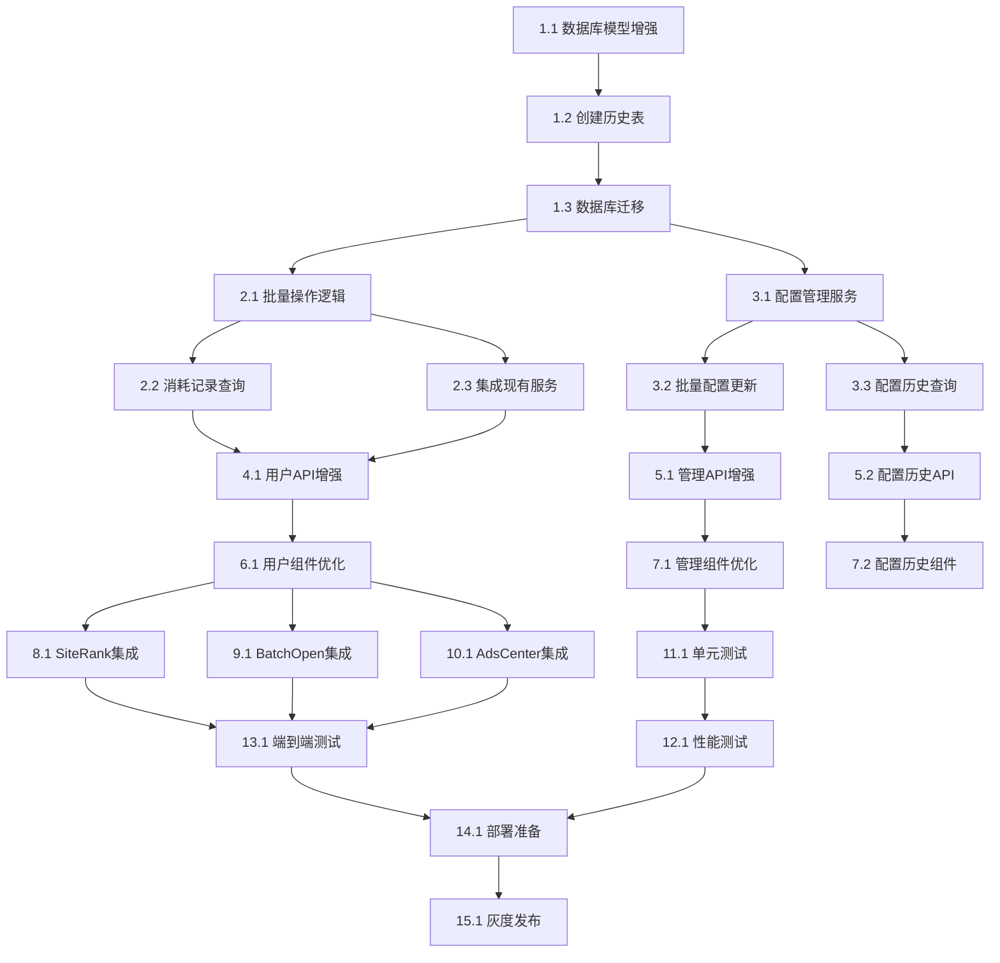

# Token消耗记录管理系统 - 实施任务

## 任务概览

基于现有的TokenUsage和TokenConfig模型，实现Token消耗记录管理系统的完整功能。重点解决批量操作记录合并显示问题，并提供灵活的Token配置管理。

## 阶段1: 数据库模型增强和服务层开发

### 任务1: 数据库模型增强
- [ ] 1.1 增强TokenUsage表结构
  - 添加batchId、batchSize、isBatch字段到现有TokenUsage模型
  - 添加details字段存储操作详细信息
  - 创建新的数据库索引优化查询性能
  - _需求: 1.2, 2.1, 2.2_

- [ ] 1.2 创建TokenConfigHistory表
  - 设计TokenConfigHistory模型记录配置变更历史
  - 建立与TokenConfig和User的关联关系
  - 创建必要的索引支持历史查询
  - _需求: 3.3, 3.4_

- [ ] 1.3 运行数据库迁移
  - 执行Prisma schema更新和数据库迁移
  - 初始化默认Token配置数据
  - 更新现有TokenUsage记录的新字段
  - _需求: 4.1, 4.2, 4.3_

### 任务2: TokenConsumptionService服务开发
- [ ] 2.1 实现批量操作记录合并逻辑
  - 创建TokenConsumptionService类
  - 实现recordBatchUsage方法处理批量操作
  - 实现批量操作ID生成和管理
  - 添加批量操作元数据合并逻辑
  - _需求: 2.1, 2.2, 2.3_

- [ ] 2.2 实现用户消耗记录查询功能
  - 实现getUserUsageHistory方法支持分页查询
  - 实现批量操作记录的合并显示逻辑
  - 添加按功能类型和时间范围的筛选功能
  - 实现getBatchOperationDetails方法获取批量操作详情
  - _需求: 1.1, 1.4, 1.5_

- [ ] 2.3 集成现有TokenService
  - 修改现有TokenService.consumeTokens方法支持批量操作
  - 添加批量操作检测和记录逻辑
  - 确保向后兼容性，不影响现有功能
  - _需求: 2.4, 2.5_

### 任务3: TokenConfigService服务开发
- [ ] 3.1 实现Token配置管理服务
  - 创建TokenConfigService类
  - 实现getAllConfigs、updateConfig方法
  - 实现配置变更历史记录功能
  - 添加配置缓存机制提升性能
  - _需求: 3.1, 3.2, 3.5_

- [ ] 3.2 实现批量配置更新功能
  - 实现batchUpdateConfigs方法
  - 添加配置变更事务处理确保数据一致性
  - 实现配置变更通知和缓存清理
  - _需求: 3.6_

- [ ] 3.3 实现配置历史查询功能
  - 实现getConfigHistory方法
  - 添加配置变更对比功能
  - 实现配置回滚功能（可选）
  - _需求: 3.4_

## 阶段2: API接口开发

### 任务4: 用户端API开发
- [ ] 4.1 增强现有用户Token API
  - 修改GET /api/user/tokens路由支持批量操作合并显示
  - 添加includeBatchDetails参数控制详情显示
  - 优化查询性能和响应格式
  - 添加批量操作统计信息
  - _需求: 1.1, 1.6, 2.1_

- [ ] 4.2 创建批量操作详情API
  - 实现GET /api/user/tokens/batch/[batchId]路由
  - 返回批量操作的详细信息和操作列表
  - 添加权限验证确保用户只能查看自己的记录
  - _需求: 2.5_

- [ ] 4.3 添加Token使用统计API
  - 实现GET /api/user/tokens/stats路由
  - 提供消耗趋势、功能分布等统计数据
  - 支持不同时间范围的统计查询
  - _需求: 1.1_

### 任务5: 管理端API开发
- [ ] 5.1 增强Token配置管理API
  - 修改现有GET /api/admin/token-config路由
  - 增强PUT /api/admin/token-config/[id]路由支持历史记录
  - 添加配置变更原因和操作者记录
  - _需求: 3.1, 3.2, 3.3_

- [ ] 5.2 创建配置历史API
  - 实现GET /api/admin/token-config/history路由
  - 支持按配置ID、功能类型筛选历史记录
  - 添加分页和排序功能
  - _需求: 3.4_

- [ ] 5.3 实现批量配置更新API
  - 实现PUT /api/admin/token-config/batch路由
  - 支持批量更新多个配置
  - 添加事务处理确保操作原子性
  - _需求: 3.6_

## 阶段3: 前端组件开发

### 任务6: 用户端组件优化
- [x] 6.1 优化TokenUsageHistory组件
  - 修改现有src/app/user/tokens/page.tsx
  - 实现批量操作记录的合并显示
  - 添加批量操作详情展开功能
  - 优化筛选和分页功能
  - _需求: 1.1, 1.4, 1.5, 2.1_

- [x] 6.2 创建BatchOperationDetail组件
  - 实现批量操作详情模态框组件
  - 显示批量操作的具体操作列表
  - 添加操作元数据展示
  - 实现响应式设计
  - _需求: 2.5_

- [x] 6.3 增强TokenUsageStats组件
  - 添加消耗趋势图表展示
  - 实现功能使用分布可视化
  - 添加批量操作统计信息
  - 支持数据导出功能
  - _需求: 1.1_

### 任务7: 管理端组件开发
- [x] 7.1 优化TokenConfigManagement组件
  - 修改现有src/app/admin/token-config/page.tsx
  - 添加配置变更历史查看功能
  - 实现内联编辑和批量操作
  - 添加配置变更原因输入
  - _需求: 3.1, 3.2, 3.6_

- [x] 7.2 创建TokenConfigHistory组件
  - 实现配置变更历史展示组件
  - 添加变更对比视图
  - 实现历史记录筛选和搜索
  - 添加配置回滚功能（可选）
  - _需求: 3.4_

- [x] 7.3 实现实时配置更新机制
  - 添加配置变更实时通知
  - 实现配置缓存自动刷新
  - 添加配置变更影响分析
  - _需求: 3.5_

## 阶段4: 集成现有功能

### 任务8: 集成SiteRank功能
- [x] 8.1 修改SiteRank批量查询逻辑
  - 识别批量域名分析操作
  - 集成TokenConsumptionService记录批量操作
  - 确保单个域名查询仍正常工作
  - _需求: 2.1, 4.1_

- [x] 8.2 更新SiteRank Token消耗配置
  - 确认SiteRank功能的Token配置正确
  - 测试配置变更对SiteRank功能的影响
  - _需求: 4.1_

### 任务9: 集成BatchOpen功能
- [x] 9.1 修改BatchOpen批量访问逻辑
  - 识别批量URL访问操作
  - 集成批量操作记录功能
  - 保持现有批量访问功能不变
  - _需求: 2.2, 4.2_

- [x] 9.2 更新BatchOpen Token消耗配置
  - 确认BatchOpen功能的Token配置正确
  - 测试批量访问的Token消耗记录
  - _需求: 4.2_

### 任务10: 集成AdsCenter功能
- [x] 10.1 修改AdsCenter批量替换逻辑
  - 识别批量链接替换操作
  - 集成批量操作记录功能
  - 确保单个链接替换正常工作
  - _需求: 2.3, 4.3_

- [x] 10.2 更新AdsCenter Token消耗配置
  - 确认AdsCenter功能的Token配置正确
  - 测试链接替换的Token消耗记录
  - _需求: 4.3_

## 阶段5: 测试和优化

### 任务11: 单元测试开发
- [x] 11.1 编写TokenConsumptionService测试
  - 测试批量操作记录合并逻辑
  - 测试用户消耗记录查询功能
  - 测试批量操作详情获取
  - _需求: 所有功能需求_

- [x] 11.2 编写TokenConfigService测试
  - 测试配置管理功能
  - 测试配置变更历史记录
  - 测试批量配置更新
  - _需求: 3.1, 3.2, 3.3, 3.6_

- [x] 11.3 编写API集成测试
  - 测试用户端API功能
  - 测试管理端API功能
  - 测试权限控制和数据验证
  - _需求: 所有API需求_

### 任务12: 性能测试和优化
- [x] 12.1 进行数据库查询性能测试
  - 测试大量历史记录的查询性能
  - 优化数据库索引和查询语句
  - 测试批量操作的处理性能
  - _需求: 性能要求_

- [x] 12.2 实现缓存优化
  - 实现Token配置缓存机制
  - 添加用户统计数据缓存
  - 测试缓存命中率和性能提升
  - _需求: 性能要求_

- [x] 12.3 进行前端性能优化
  - 优化组件渲染性能
  - 实现虚拟滚动处理大量记录
  - 添加数据懒加载功能
  - _需求: 用户体验要求_

### 任务13: 端到端测试
- [x] 13.1 测试完整的批量操作流程
  - 测试从批量操作到记录显示的完整流程
  - 验证批量操作合并逻辑正确性
  - 测试批量操作详情查看功能
  - _需求: 2.1, 2.2, 2.3, 2.5_

- [x] 13.2 测试Token配置管理流程
  - 测试配置创建、更新、删除流程
  - 验证配置变更历史记录功能
  - 测试配置变更的实时生效
  - _需求: 3.1, 3.2, 3.3, 3.4, 3.5_

- [x] 13.3 测试系统集成
  - 测试与现有功能的集成
  - 验证向后兼容性
  - 测试并发操作的数据一致性
  - _需求: 所有集成需求_

## 阶段6: 部署和监控

### 任务14: 部署准备
- [x] 14.1 准备生产环境配置
  - 配置生产数据库迁移脚本
  - 设置Redis缓存配置
  - 准备环境变量和配置文件
  - _需求: 技术要求_

- [x] 14.2 实现监控和日志
  - 添加关键操作的审计日志
  - 实现API性能监控
  - 添加错误报告和告警机制
  - _需求: 安全要求_

- [x] 14.3 编写部署文档
  - 编写部署步骤文档
  - 创建运维手册
  - 准备故障排除指南
  - _需求: 实施计划_

### 任务15: 灰度发布
- [x] 15.1 实施灰度发布策略
  - 先发布后端API和服务
  - 逐步开放前端功能
  - 监控系统性能和错误率
  - _需求: 实施计划_

- [x] 15.2 用户培训和文档
  - 编写用户使用指南
  - 创建管理员操作手册
  - 准备功能演示和培训材料
  - _需求: 用户体验要求_

- [x] 15.3 收集反馈和优化
  - 收集用户使用反馈
  - 监控系统性能指标
  - 根据反馈进行功能优化
  - _需求: 验收标准_

## 任务依赖关系

## 里程碑

- **里程碑1** (第1周): 数据库模型增强和核心服务开发完成
- **里程碑2** (第2周): API接口开发和前端组件优化完成  
- **里程碑3** (第3周): 现有功能集成和测试完成
- **里程碑4** (第4周): 部署上线和用户培训完成

## 风险评估

### 高风险任务
- 任务2.1: 批量操作记录合并逻辑（技术复杂度高）
- 任务8-10: 现有功能集成（可能影响现有功能）
- 任务13: 端到端测试（可能发现集成问题）

### 缓解措施
- 提前进行技术原型验证
- 增加代码审查和测试覆盖率
- 准备回滚方案和数据备份
- 分阶段发布降低风险