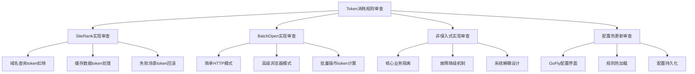

# 设计文档

## 概述

本设计文档提供了token消耗实现审查的架构方案。该方案需要评估现有代码库是否已正确实现了5个核心业务场景的token消耗逻辑，并确保实现是非侵入式的、可配置的，并支持热更新。

## 代码复用分析

### 现有组件分析
- **Token系统基础架构**：评估现有token余额管理和交易记录系统
- **SiteRank模块**：检查域名查询功能的token消耗集成点
- **BatchOpen模块**：分析批量访问功能中的简单HTTP和高级浏览器访问模式
- **GoFly后台管理**：审查配置管理和热更新机制的实现状态

### 集成点
- **用户系统**：token余额与用户账户的关联
- **API层**：token消耗验证和扣除的拦截点
- **配置系统**：token规则的存储和热加载机制
- **监控日志**：token交易记录和审计跟踪

## 架构设计

### 审查架构


### 审查组件和接口

#### 1. SiteRank Token消耗审查组件
- **目的**：验证SiteRank功能是否正确实现每个成功域名查询消耗1个token
- **检查点**：
  - 查询成功时的token扣除逻辑
  - 缓存命中时的token处理
  - 查询失败时的token保护机制
- **接口**：`checkSiteRankTokenImplementation()`

#### 2. BatchOpen Token消耗审查组件
- **目的**：验证BatchOpen功能是否根据访问模式正确计算token消耗
- **检查点**：
  - 简单HTTP模式：1 token/成功URL
  - 高级浏览器模式：2 token/成功URL
  - 批量操作的原子性处理
- **接口**：`checkBatchOpenTokenImplementation()`

#### 3. 非侵入式实现审查组件
- **目的**：验证token系统是否与核心业务逻辑解耦
- **检查点**：
  - AOP或中间件模式使用
  - 核心功能的独立性
  - token系统故障时的降级策略
- **接口**：`checkNonIntrusiveImplementation()`

#### 4. 配置热更新审查组件
- **目的**：验证GoFly后台的配置管理和热更新能力
- **检查点**：
  - 配置界面完整性
  - 热加载机制实现
  - 配置持久化和一致性
- **接口**：`checkHotReloadImplementation()`

## 数据模型审查

### Token交易记录模型
```typescript
interface TokenTransaction {
  id: string;
  userId: string;
  amount: number;
  type: 'CONSUME' | 'REFUND' | 'ADD';
  source: 'SITERANK' | 'BATCHOPEN_SIMPLE' | 'BATCHOPEN_ADVANCED';
  referenceId: string; // 关联的业务ID
  status: 'SUCCESS' | 'FAILED' | 'PENDING';
  createdAt: Date;
  metadata?: {
    domain?: string; // SiteRank域名
    url?: string; // BatchOpen URL
    accessMode?: 'SIMPLE_HTTP' | 'ADVANCED_BROWSER';
  };
}
```

### Token规则配置模型
```typescript
interface TokenRule {
  id: string;
  feature: 'SITERANK' | 'BATCHOPEN_SIMPLE' | 'BATCHOPEN_ADVANCED';
  tokensPerUnit: number;
  description: string;
  isActive: boolean;
  updatedAt: Date;
  version: number;
}
```

## 错误处理审查

### 关键错误场景
1. **Token余额不足**
   - 处理方式：在操作前预检查，避免部分成功
   - 用户影响：清晰的余额不足提示

2. **Token系统故障**
   - 处理方式：降级模式，记录交易日志供后续补扣
   - 用户影响：业务功能继续，系统记录异常

3. **并发操作冲突**
   - 处理方式：乐观锁或分布式锁确保余额一致性
   - 用户影响：可能短暂延迟，但数据准确

4. **配置更新失败**
   - 处理方式：回滚到上一个有效配置
   - 用户影响：系统继续使用旧规则运行

## 测试策略

### 单元测试审查
- SiteRank查询的token扣除逻辑测试
- BatchOpen不同访问模式的token计算测试
- 配置加载和热更新机制测试

### 集成测试审查
- 端到端的token消耗流程测试
- 并发场景下的token余额一致性测试
- 配置热更新的实时生效测试

### 性能测试审查
- 高频操作下的token系统性能影响
- 批量操作的token处理效率
- 配置热更新的系统负载测试

## 实现检查清单

### SiteRank功能检查
- [ ] 每个成功查询扣除1个token
- [ ] 缓存数据也扣除token
- [ ] 查询失败不扣除token
- [ ] 提供查询结果和token消耗明细

### BatchOpen功能检查
- [ ] 简单HTTP模式成功访问扣除1个token
- [ ] 高级浏览器模式成功访问扣除2个token
- [ ] 失败访问不扣除token
- [ ] 批量结果包含token消耗汇总

### 非侵入式实现检查
- [ ] 使用AOP或中间件模式
- [ ] 核心业务逻辑无token相关代码
- [ ] 可通过配置开关token功能
- [ ] token系统故障不影响核心功能

### 配置热更新检查
- [ ] GoFly后台有token规则配置界面
- [ ] 配置修改后立即生效
- [ ] 支持配置版本管理和回滚
- [ ] 配置修改有审计日志