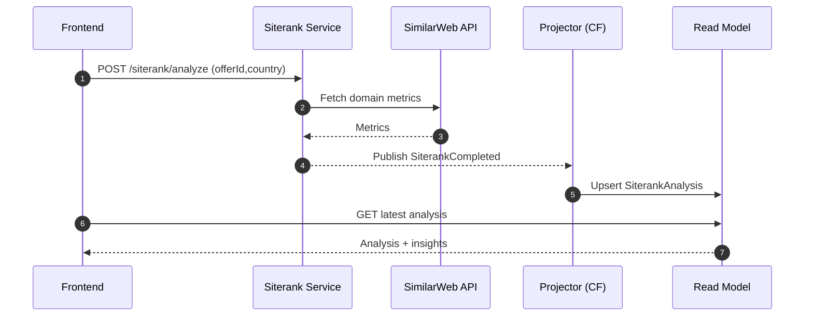
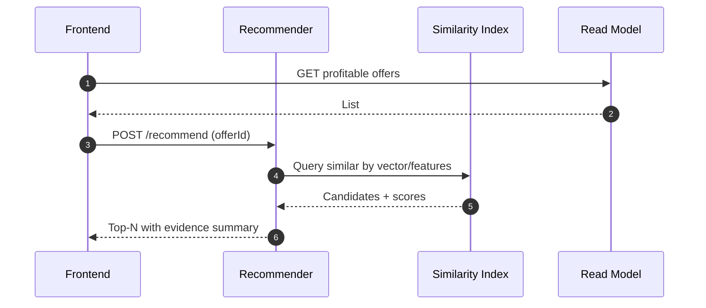
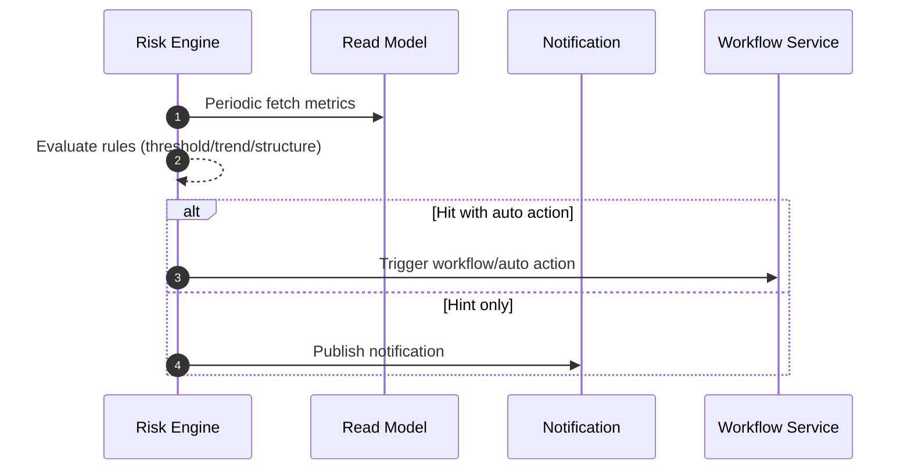
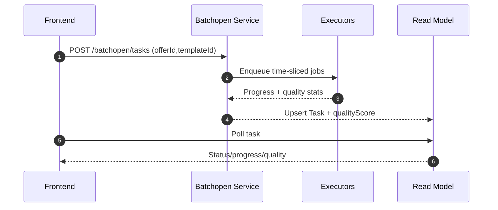
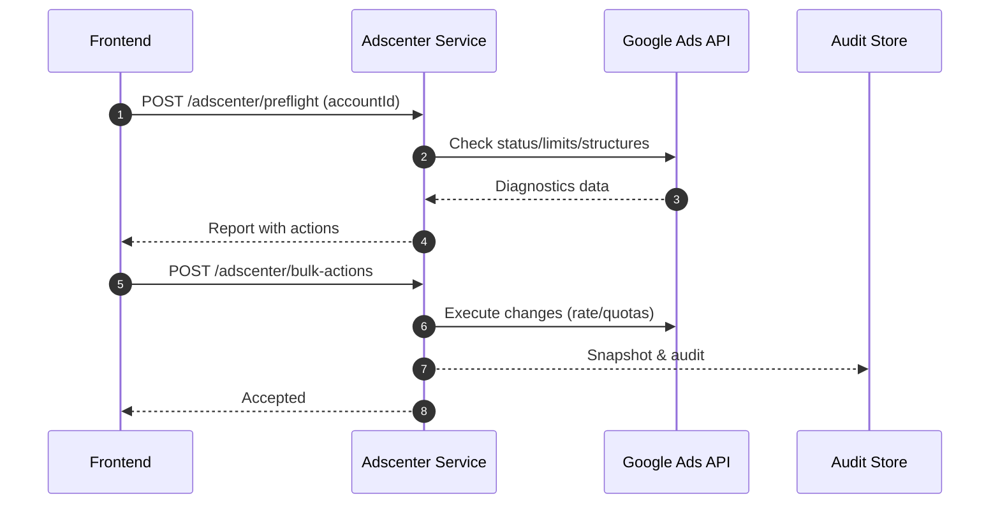

# Architecture — 架构与技术

## 总览
- 采用 DDD 微服务 + 事件溯源（Event Sourcing）+ Pub/Sub 的异步解耦架构，运行于 Cloud Run / Cloud Functions。

## 服务边界（Bounded Context）
- Identity / Billing / Offer / Siterank / Batchopen / Adscenter / Workflow
- 共用能力：Auth 中间件、Secret Manager、数据库连接、事件发布/订阅封装（pkg/*）。

## 事件溯源
- Event Store（PostgreSQL）仅写入不可变事件；读模型为可重建投影（PostgreSQL/Firestore）。
- 流程：Command → Handler → Event → Pub/Sub → Projector（Cloud Functions）→ Read Model。

## 数据隔离与安全
- 无租户，按 user_id 强隔离；服务端行级鉴权、最小权限；Firestore Security Rules 最小可行。
- 管控：接口幂等、原子扣费、失败回滚；审计日志与变更快照。

## 可观测性与容量
- 日志/指标/追踪三件套；关键 SLO：评估快扫响应、批量操作成功率、仿真质量评分延迟。

## 关键流程（序列图建议补充）
- 评估：前端→Siterank→SimilarWeb→投影器→读模型→前端
- 仿真：前端→Batchopen→任务编排→执行→质量评分→读模型
- 放大：前端→Adscenter→Pre-flight→批量变更→审计/回滚

