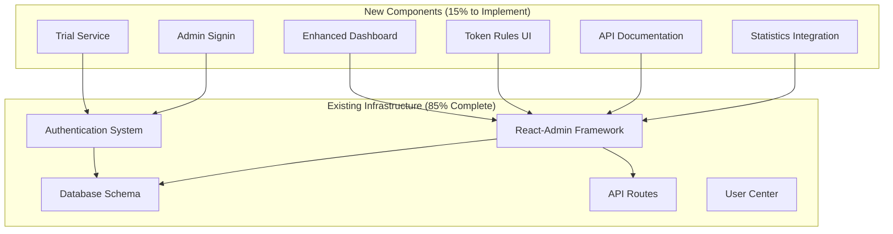

# Design Document

## Overview

This document outlines the design for completing the admin management system for the AutoAds platform. Based on comprehensive code analysis, the system is 85% complete with a solid React-Admin framework, comprehensive database schema, and extensive API coverage. The design focuses on implementing the remaining 8 components to fulfill all 25 business requirements while building upon the existing robust foundation.

## Current Architecture Analysis

### Existing Infrastructure (✅ Complete)

**React-Admin Framework:**
- Complete admin interface at `/admin-dashboard`
- Custom data provider (`AutoAdsDataProvider`) with full CRUD operations
- Authentication provider with NextAuth integration
- Custom theme and layout with responsive design
- 17+ resource components with list, edit, create, show views

**Database Schema:**
- Comprehensive Prisma schema with 25+ models
- User management with roles and permissions
- Subscription and payment management
- Token usage and transaction tracking
- Notification and audit logging
- All required relationships and indexes

**API Infrastructure:**
- 25+ admin API endpoints under `/api/admin/`
- Authentication and authorization middleware
- Rate limiting and security measures
- Comprehensive error handling
- Real-time statistics and analytics

**Core Systems:**
- Google OAuth authentication with NextAuth
- User center with subscription management
- Stripe payment integration
- Token consumption tracking
- Email notification system
- Environment variable management with hot-reload

## Implementation Design

### 1. 14-Day Pro Trial System

**Component:** Trial Assignment Service
**Location:** `src/lib/services/trial-service.ts`

```typescript
interface TrialService {
  assignTrialToNewUser(userId: string): Promise<Subscription>;
  checkTrialExpiration(): Promise<void>;
  convertTrialToFree(userId: string): Promise<void>;
}
```

**Implementation Strategy:**
- Hook into existing Google OAuth callback
- Create system subscription with 14-day duration
- Background job for trial expiration checking
- Integration with existing subscription management

**Database Changes:** None required (existing models support trial subscriptions)

**API Integration:** Extend existing `/api/auth/[...nextauth]/route.ts`

### 2. Admin Signin Page

**Component:** Admin Authentication Page
**Location:** `src/app/auth/admin-signin/page.tsx`

```typescript
interface AdminSigninProps {
  redirectUrl?: string;
  error?: string;
}
```

**Design Features:**
- Dedicated admin login form
- Email/password authentication
- Role validation (ADMIN, SUPER_ADMIN)
- Redirect to `/admin-dashboard` on success
- Error handling and validation

**Integration:** Extend existing NextAuth configuration

### 3. Enhanced Dashboard Metrics

**Component:** Dashboard Enhancement
**Location:** `src/admin/components/Dashboard.tsx` (enhance existing)

**Current Status:** Basic dashboard exists, needs specific metrics layout

**Enhancement Areas:**
- Trial user highlighting in subscription metrics
- Feature-specific token consumption breakdown
- Growth indicators with percentage changes
- Quick action improvements
- Real-time data refresh

**API Integration:** Enhance existing `/api/admin/dashboard/stats/route.ts`

### 4. User Statistics Dashboard Integration

**Component:** Route Integration
**Location:** `src/admin/AdminAppWithRouter.tsx` (add route)

**Current Status:** UserStatisticsDashboard component exists, needs route integration

**Implementation:**
- Add custom route for user statistics
- Integrate with existing statistics API
- Add navigation menu item
- Chart data integration

### 5. Token Consumption Rules Interface

**Component:** Token Rules Management
**Location:** `src/admin/resources/tokens/TokenRulesList.tsx` (new)

**Current Status:** API exists at `/api/admin/tokens/rules/`, needs UI

```typescript
interface TokenRule {
  id: string;
  feature: 'siterank' | 'batchopen' | 'adscenter';
  action: string;
  baseCost: number;
  conditions: Record<string, any>;
  description: string;
  isActive: boolean;
}
```

**Features:**
- List view with current rules
- Edit interface for cost modification
- Hot-reload capability
- Change history tracking

### 6. API List Documentation Interface

**Component:** API Documentation Component
**Location:** `src/admin/resources/api/ApiList.tsx` (new)

**Design Features:**
- Categorized API endpoint listing
- Method, path, and description display
- Authentication requirements
- Request/response examples
- Status indicators

**Data Source:** Static configuration with API metadata

### 7. Enhanced API Analytics Integration

**Component:** API Analytics Enhancement
**Location:** `src/admin/resources/api/ApiAnalyticsDashboard.tsx` (enhance existing)

**Current Status:** Component exists, needs comprehensive data integration

**Enhancement Areas:**
- Real-time metrics integration
- Performance charts and graphs
- Error rate monitoring
- Usage pattern analysis
- Alert system integration

### 8. Pricing Page Enhancement

**Component:** Pricing Page Update
**Location:** `src/components/pricing/PricingPage.tsx` (enhance existing)

**Current Status:** Complete pricing page exists, needs trial information

**Enhancement Areas:**
- Trial period information display
- Trial status indicators
- Enhanced FAQ section
- Better plan comparison

## Technical Architecture

### Component Integration Strategy



### Data Flow Design

**Trial Assignment Flow:**
1. User completes Google OAuth
2. Check if new user (first login)
3. Create trial subscription record
4. Update user permissions
5. Display trial information in user center

**Admin Authentication Flow:**
1. Admin accesses `/auth/admin-signin`
2. Validate credentials against user table
3. Check role (ADMIN/SUPER_ADMIN)
4. Create session and redirect to dashboard
5. Enforce role-based access control

**Token Rules Management Flow:**
1. Admin accesses token rules interface
2. Display current rules from API
3. Allow cost modifications
4. Update environment variables
5. Trigger hot-reload for immediate effect

## Database Integration

### No Schema Changes Required

The existing Prisma schema already supports all required functionality:

- **Trial Subscriptions:** `Subscription` model with `provider='system'`
- **Token Rules:** Environment variables for configuration
- **Admin Authentication:** User model with role field
- **Statistics:** Comprehensive analytics models
- **API Documentation:** Static configuration approach

### Data Access Patterns

**Trial Management:**
```typescript
// Create trial subscription
await prisma.subscription.create({
  data: {
    userId,
    planId: 'pro-plan-id',
    status: 'ACTIVE',
    provider: 'system',
    currentPeriodStart: new Date(),
    currentPeriodEnd: new Date(Date.now() + 14 * 24 * 60 * 60 * 1000)
  }
});
```

**Token Rules Configuration:**
```typescript
// Update token costs via environment variables
await prisma.environmentVariable.upsert({
  where: { key: 'TOKEN_COST_SITERANK' },
  update: { value: newCost.toString() },
  create: { key: 'TOKEN_COST_SITERANK', value: newCost.toString() }
});
```

## API Design

### New API Endpoints

**Trial Management:**
- `POST /api/admin/trials/assign` - Assign trial to user
- `GET /api/admin/trials/expiring` - Get expiring trials
- `POST /api/admin/trials/convert` - Convert trial to free

**API Documentation:**
- `GET /api/admin/api/list` - Get all API endpoints
- `GET /api/admin/api/docs` - Get API documentation

### Enhanced Existing Endpoints

**Dashboard Statistics:**
- Enhance `/api/admin/dashboard/stats` with trial metrics
- Add growth indicators and trend analysis

**User Statistics:**
- Enhance `/api/admin/user-statistics` with chart data
- Add date range filtering and grouping options

## UI/UX Design

### Design Principles

1. **Consistency:** Follow existing React-Admin patterns
2. **Simplicity:** Clean, functional interfaces
3. **Responsiveness:** Mobile-friendly design
4. **Accessibility:** WCAG compliance
5. **Performance:** Efficient data loading and caching

### Component Design Patterns

**List Components:**
- Consistent with existing React-Admin list patterns
- Filtering, sorting, and pagination
- Export functionality
- Bulk operations where appropriate

**Form Components:**
- Validation and error handling
- Auto-save capabilities
- Confirmation dialogs for destructive actions
- Help text and tooltips

**Dashboard Components:**
- Card-based layout
- Real-time data updates
- Interactive charts and graphs
- Quick action buttons

### Theme Integration

Use existing admin theme (`src/admin/theme/adminTheme.ts`):
- Material-UI components
- Consistent color scheme
- Typography and spacing
- Dark/light theme support

## Security Considerations

### Authentication & Authorization

**Admin Access Control:**
- Role-based access (ADMIN, SUPER_ADMIN)
- Session management
- CSRF protection
- Rate limiting

**API Security:**
- JWT token validation
- Request validation
- Input sanitization
- Audit logging

### Data Protection

**Sensitive Information:**
- Environment variable encryption
- Token cost configuration security
- Admin action logging
- User data privacy

## Performance Optimization

### Frontend Performance

**React-Admin Optimizations:**
- Lazy loading of components
- Efficient data fetching
- Caching strategies
- Bundle size optimization

**Dashboard Performance:**
- Real-time data with WebSocket (future)
- Efficient chart rendering
- Data aggregation
- Progressive loading

### Backend Performance

**API Optimizations:**
- Database query optimization
- Response caching
- Connection pooling
- Background job processing

## Testing Strategy

### Component Testing

**New Components:**
- Unit tests for all new components
- Integration tests for API interactions
- E2E tests for critical workflows
- Accessibility testing

**Enhanced Components:**
- Regression tests for existing functionality
- Performance tests for dashboard
- User experience testing

### API Testing

**New Endpoints:**
- Unit tests for business logic
- Integration tests with database
- Security testing
- Performance testing

## Deployment Strategy

### Incremental Deployment

**Phase 1: Core Components**
1. Trial assignment service
2. Admin signin page
3. Enhanced dashboard

**Phase 2: Management Interfaces**
4. Token rules interface
5. API documentation
6. Statistics integration

**Phase 3: Enhancements**
7. API analytics enhancement
8. Pricing page updates

### Environment Configuration

**Development:**
- Local database and Redis
- Mock external services
- Debug logging enabled

**Staging:**
- Production-like environment
- Real external service integration
- Performance monitoring

**Production:**
- Optimized builds
- CDN integration
- Monitoring and alerting

## Integration Points

### Existing System Integration

**React-Admin Framework:**
- Extend existing resource definitions
- Use established data provider patterns
- Follow existing routing conventions
- Maintain theme consistency

**Authentication System:**
- Integrate with NextAuth configuration
- Extend existing session management
- Use established role-based access patterns

**Database Integration:**
- Use existing Prisma client
- Follow established model patterns
- Maintain data consistency
- Use existing migration system

### External Service Integration

**Stripe Integration:**
- Use existing payment provider setup
- Extend webhook handling
- Maintain transaction consistency

**Email Service:**
- Use existing notification system
- Extend template management
- Maintain delivery tracking

## Monitoring and Analytics

### System Monitoring

**Performance Metrics:**
- Dashboard load times
- API response times
- Database query performance
- User interaction tracking

**Business Metrics:**
- Trial conversion rates
- Admin usage patterns
- Feature adoption rates
- System health indicators

### Error Tracking

**Frontend Errors:**
- Component error boundaries
- User action tracking
- Performance monitoring
- Accessibility compliance

**Backend Errors:**
- API error logging
- Database error tracking
- External service failures
- Security event monitoring

## Future Extensibility

### Scalability Considerations

**Horizontal Scaling:**
- Stateless component design
- API load balancing
- Database read replicas
- CDN integration

**Feature Extensions:**
- Plugin architecture support
- Custom dashboard widgets
- Advanced analytics
- Mobile app integration

### Maintenance Strategy

**Code Maintenance:**
- Regular dependency updates
- Security patch management
- Performance optimization
- Documentation updates

**Data Maintenance:**
- Database optimization
- Log rotation
- Backup strategies
- Archive policies

## Success Metrics

### Implementation Success

**Functional Metrics:**
- All 25 business requirements fulfilled
- Zero regression in existing functionality
- Performance maintained or improved
- Security standards upheld

**Quality Metrics:**
- Code coverage > 80%
- Performance benchmarks met
- Accessibility compliance
- User experience satisfaction

### Business Success

**User Metrics:**
- Trial conversion rate tracking
- Admin productivity improvements
- System reliability metrics
- Feature adoption rates

**Technical Metrics:**
- System uptime > 99.9%
- API response time < 200ms
- Error rate < 0.1%
- Security incident rate = 0

## Conclusion

This design builds upon the excellent existing foundation (85% complete) to deliver a comprehensive admin management system. The approach prioritizes:

1. **Minimal Risk:** Building on proven infrastructure
2. **Maximum Value:** Completing all 25 business requirements
3. **Maintainability:** Following established patterns
4. **Performance:** Leveraging existing optimizations
5. **Security:** Maintaining high security standards

The implementation focuses on 8 specific components that will complete the system while preserving all existing functionality and maintaining the high quality standards already established.