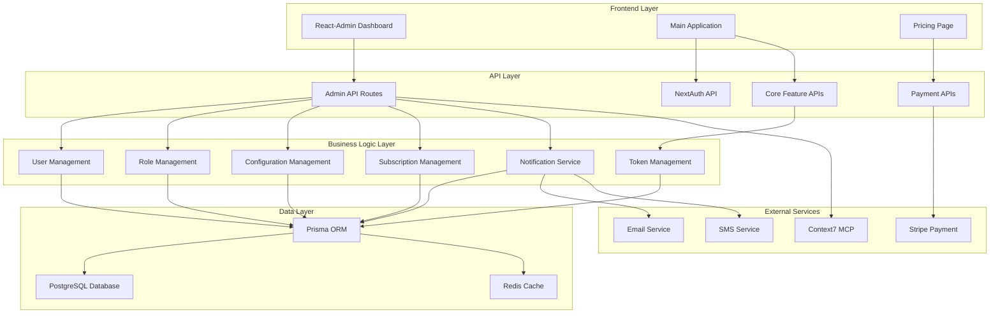

# Design Document

## Overview

This document outlines the design for a comprehensive admin management system built with React-Admin framework. The system provides a complete backend administration interface with user management, role-based access control, configuration management, subscription management, payment integration, notification system, and API management. The design follows Clean Architecture principles with simplified implementation focused on practical functionality.

**Current Implementation Status:**
- ✅ **React-Admin Framework**: Fully implemented with custom providers and theme
- ✅ **Admin Dashboard**: Complete with system monitoring and metrics
- ✅ **User Management**: CRUD operations with role-based access control
- ✅ **Configuration Management**: Environment variables and system settings
- ✅ **Subscription Management**: Plan management and subscription tracking
- ✅ **Pricing Page**: Complete pricing page with plan comparison
- ✅ **Navigation Integration**: Admin panel accessible from header navigation
- ✅ **API Routes**: Comprehensive admin API endpoints
- ✅ **Authentication**: Role-based access control with NextAuth integration
- ✅ **Database Schema**: Complete Prisma schema with all required models

**Remaining Implementation:**
- 🔄 **Token Management UI**: Enhanced token configuration interface
- 🔄 **Payment Integration**: Stripe integration completion
- 🔄 **Notification System**: Email/SMS notification management
- 🔄 **API Management**: Enhanced API monitoring and management
- 🔄 **Documentation**: Complete system documentation

## Architecture

### High-Level Architecture



### Technology Stack

- **Frontend**: React-Admin, Next.js 14, TypeScript, Tailwind CSS
- **Backend**: Next.js API Routes, NextAuth.js
- **Database**: PostgreSQL with Prisma ORM
- **Cache**: Redis
- **Authentication**: Google OAuth via NextAuth.js
- **Payment**: Stripe (primary), extensible for PayPal
- **Notifications**: Email (Nodemailer), SMS (future)
- **Documentation**: Context7 MCP for third-party API guidance

## Components and Interfaces

### 1. Admin Dashboard Interface

#### Main Dashboard Layout
```typescript
interface AdminDashboardProps {
  user: User;
  metrics: DashboardMetrics;
  quickActions: QuickAction[];
}

interface DashboardMetrics {
  totalUsers: number;
  activeSubscriptions: number;
  monthlyRevenue: number;
  tokenConsumption: number;
  systemHealth: 'healthy' | 'warning' | 'critical';
}
```

#### Navigation Structure
- **Dashboard**: System overview and metrics
- **Users**: User management and analytics
- **Roles**: Role and permission management
- **Plans**: Subscription plan configuration
- **Payments**: Payment and billing management
- **Configuration**: System and environment settings
- **Notifications**: Message templates and delivery
- **API**: API management and monitoring
- **Reports**: Analytics and usage reports

### 2. User Management System

#### User Management Interface
```typescript
interface UserManagementProps {
  users: User[];
  filters: UserFilters;
  pagination: PaginationConfig;
}

interface UserFilters {
  role?: UserRole;
  status?: UserStatus;
  subscriptionPlan?: string;
  registrationDate?: DateRange;
  lastLoginDate?: DateRange;
}

interface UserActions {
  editUser: (userId: string, updates: Partial<User>) => Promise<void>;
  changeUserRole: (userId: string, role: UserRole) => Promise<void>;
  suspendUser: (userId: string, reason: string) => Promise<void>;
  resetUserTokens: (userId: string) => Promise<void>;
}
```

#### User Profile Modal
- Personal information display
- Subscription details and history
- Token usage analytics
- Activity logs
- Quick actions (suspend, reset tokens, change role)

### 3. Role-Based Access Control

#### Role Management Interface
```typescript
interface RoleConfig {
  role: UserRole;
  permissions: Permission[];
  features: FeatureAccess[];
  limits: RoleLimits;
}

interface Permission {
  resource: string;
  actions: ('create' | 'read' | 'update' | 'delete')[];
}

interface FeatureAccess {
  feature: 'siterank' | 'batchopen' | 'adscenter';
  enabled: boolean;
  limits?: FeatureLimits;
}
```

#### Role Hierarchy
1. **Super Administrator**: Full system access, user management, system configuration
2. **Administrator**: User management, content management, limited system configuration
3. **Regular User**: Access to subscribed features only

### 4. Configuration Management System

#### Environment Variables Management
```typescript
interface EnvironmentVariable {
  id: string;
  key: string;
  value: string;
  isSecret: boolean;
  isHotReloadable: boolean;
  category: 'database' | 'api' | 'feature' | 'security';
  description: string;
  validationRule?: string;
}

interface ConfigurationManager {
  getConfig: (key: string) => Promise<string>;
  updateConfig: (key: string, value: string, reason?: string) => Promise<void>;
  hotReload: (keys: string[]) => Promise<void>;
  validateConfig: (key: string, value: string) => Promise<boolean>;
}
```

#### Feature Flags and Limits
```typescript
interface FeatureFlag {
  name: string;
  enabled: boolean;
  rolloutPercentage: number;
  conditions?: Json;
}

interface RateLimit {
  feature: string;
  userRole: UserRole;
  requestsPerMinute: number;
  requestsPerHour: number;
  requestsPerDay: number;
}
```

### 5. Subscription and Plan Management

#### Plan Configuration Interface
```typescript
interface PlanConfig {
  id: string;
  name: 'Free' | 'Pro' | 'Max';
  displayName: string;
  description: string;
  pricing: {
    monthly: number;
    yearly: number;
    currency: string;
  };
  features: PlanFeature[];
  limits: PlanLimits;
  tokenQuota: number;
  isActive: boolean;
}

interface PlanFeature {
  feature: string;
  enabled: boolean;
  limits?: FeatureLimits;
}

interface PlanLimits {
  maxTokensPerMonth: number;
  maxRequestsPerMinute: number;
  maxBatchSize: number;
  features: Record<string, FeatureLimits>;
}
```

#### Pricing Page Design
- Plan comparison table
- Feature highlights
- Pricing toggle (monthly/yearly)
- Call-to-action buttons
- FAQ section
- Integration with Stripe checkout

### 6. Token Consumption Management

#### Token Configuration
```typescript
interface TokenConfig {
  feature: string;
  action: string;
  cost: number;
  description: string;
  isActive: boolean;
}

interface TokenUsageAnalytics {
  userId: string;
  feature: string;
  totalConsumed: number;
  averagePerOperation: number;
  peakUsagePeriod: DateRange;
  projectedMonthlyUsage: number;
}
```

#### Default Token Costs
- **SiteRank**: 1 token per domain analysis
- **BatchOpen**: 1 token per URL access
- **AdsCenter**: 2 tokens per link replacement operation

### 7. Payment Integration System

#### Stripe Integration
```typescript
interface StripeConfig {
  publishableKey: string;
  secretKey: string;
  webhookSecret: string;
  priceIds: {
    [planName: string]: {
      monthly: string;
      yearly: string;
    };
  };
}

interface PaymentProcessor {
  createSubscription: (userId: string, planId: string, paymentMethodId: string) => Promise<Subscription>;
  updateSubscription: (subscriptionId: string, newPlanId: string) => Promise<Subscription>;
  cancelSubscription: (subscriptionId: string, cancelAtPeriodEnd: boolean) => Promise<void>;
  processWebhook: (event: Stripe.Event) => Promise<void>;
}
```

#### Payment Provider Abstraction
```typescript
interface PaymentProvider {
  name: string;
  createSubscription: (params: CreateSubscriptionParams) => Promise<SubscriptionResult>;
  updateSubscription: (params: UpdateSubscriptionParams) => Promise<SubscriptionResult>;
  cancelSubscription: (subscriptionId: string) => Promise<void>;
  handleWebhook: (payload: any, signature: string) => Promise<WebhookResult>;
}
```

### 8. Notification Management System

#### Notification Templates
```typescript
interface NotificationTemplate {
  id: string;
  name: string;
  type: 'email' | 'sms' | 'push' | 'in_app';
  subject?: string;
  content: string;
  variables: string[];
  category: 'marketing' | 'transactional' | 'system';
}

interface NotificationService {
  sendEmail: (template: string, recipient: string, variables: Record<string, any>) => Promise<void>;
  sendSMS: (template: string, phoneNumber: string, variables: Record<string, any>) => Promise<void>;
  scheduleNotification: (notification: ScheduledNotification) => Promise<void>;
  getDeliveryStatus: (notificationId: string) => Promise<DeliveryStatus>;
}
```

### 9. API Management System

#### API Monitoring
```typescript
interface ApiMetrics {
  endpoint: string;
  method: string;
  totalRequests: number;
  averageResponseTime: number;
  errorRate: number;
  rateLimitHits: number;
  lastHour: MetricSnapshot;
  lastDay: MetricSnapshot;
}

interface ApiRateLimit {
  endpoint: string;
  userRole: UserRole;
  requestsPerMinute: number;
  requestsPerHour: number;
  requestsPerDay: number;
}
```

## Data Models

### Core Models (Already Defined in Prisma Schema)

The existing Prisma schema already includes comprehensive models for:
- User management with roles and authentication
- Subscription and payment management
- Token usage and configuration
- Environment variables and system configuration
- Notification system
- API usage tracking
- Security and audit logging

### Additional Models for Admin System

```typescript
// Admin Dashboard Configuration
interface AdminDashboardConfig {
  userId: string;
  layout: DashboardLayout;
  widgets: WidgetConfig[];
  preferences: UserPreferences;
  theme: 'light' | 'dark';
}

// Feature Flag Management
interface FeatureFlag {
  name: string;
  enabled: boolean;
  rolloutPercentage: number;
  conditions?: Json;
  metadata?: Json;
}

// System Health Monitoring
interface SystemHealth {
  service: string;
  status: 'healthy' | 'warning' | 'critical';
  responseTime?: number;
  lastCheck: Date;
  errorMessage?: string;
}
```

## Error Handling

### Error Categories
1. **Validation Errors**: Input validation failures
2. **Authentication Errors**: Login and permission issues
3. **Business Logic Errors**: Rule violations and constraints
4. **External Service Errors**: Third-party API failures
5. **System Errors**: Database and infrastructure issues

### Error Response Format
```typescript
interface ApiError {
  code: string;
  message: string;
  details?: any;
  timestamp: string;
  requestId: string;
}

interface ErrorHandler {
  handleValidationError: (error: ValidationError) => ApiError;
  handleAuthenticationError: (error: AuthError) => ApiError;
  handleBusinessLogicError: (error: BusinessError) => ApiError;
  handleSystemError: (error: SystemError) => ApiError;
}
```

## Testing Strategy

### Unit Testing
- Component testing with React Testing Library
- Business logic testing with Jest
- API endpoint testing with supertest
- Database model testing with Prisma

### Integration Testing
- Authentication flow testing
- Payment integration testing
- Notification delivery testing
- API rate limiting testing

### End-to-End Testing
- Admin dashboard workflows
- User management scenarios
- Subscription management flows
- Configuration management testing

### Performance Testing
- Database query optimization
- API response time monitoring
- Memory usage tracking
- Concurrent user handling

## Security Considerations

### Authentication and Authorization
- Google OAuth integration via NextAuth.js
- Role-based access control (RBAC)
- Session management and timeout
- CSRF protection

### Data Protection
- Environment variable encryption
- Sensitive data masking in logs
- Database connection security
- API key management

### Input Validation
- Server-side validation for all inputs
- SQL injection prevention
- XSS protection
- Rate limiting and DDoS protection

### Audit and Monitoring
- Admin action logging
- Security event tracking
- Failed login attempt monitoring
- Suspicious activity detection

## Deployment Architecture

### Environment Configuration
- Development: Local PostgreSQL + Redis
- Preview: Staging environment with test data
- Production: Scalable cloud infrastructure

### Database Migration Strategy
- Prisma migrations for schema changes
- Data seeding for initial setup
- Backup and recovery procedures
- Zero-downtime deployment support

### Monitoring and Alerting
- Application performance monitoring
- Database performance tracking
- Error rate monitoring
- Business metrics tracking

## Integration Points

### Context7 MCP Integration
- Third-party API documentation access
- Real-time technical guidance
- Dependency compatibility checking
- Best practices recommendations

### External Service Integration
- Stripe for payment processing
- Email service for notifications
- SMS service for alerts
- Analytics services for insights

### Core Feature Integration
- BatchOpen functionality preservation
- SiteRank feature compatibility
- AdsCenter operation support
- Token consumption tracking

## Performance Optimization

### Database Optimization
- Query optimization with proper indexing
- Connection pooling configuration
- Read replica support for analytics
- Caching strategy with Redis

### Frontend Optimization
- React-Admin performance tuning
- Lazy loading for large datasets
- Pagination and filtering optimization
- Bundle size optimization

### API Optimization
- Response caching strategies
- Rate limiting implementation
- Request/response compression
- Background job processing

## Scalability Considerations

### Horizontal Scaling
- Stateless API design
- Database sharding strategy
- Load balancer configuration
- CDN integration for static assets

### Vertical Scaling
- Memory optimization
- CPU usage monitoring
- Database performance tuning
- Cache optimization

### Future Extensibility
- Plugin architecture for new features
- API versioning strategy
- Microservices migration path
- Third-party integration framework