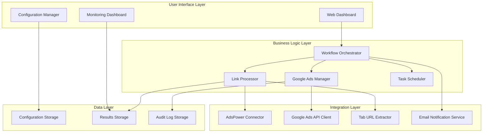
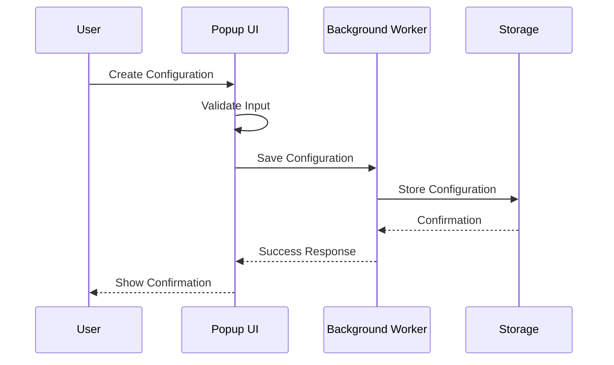
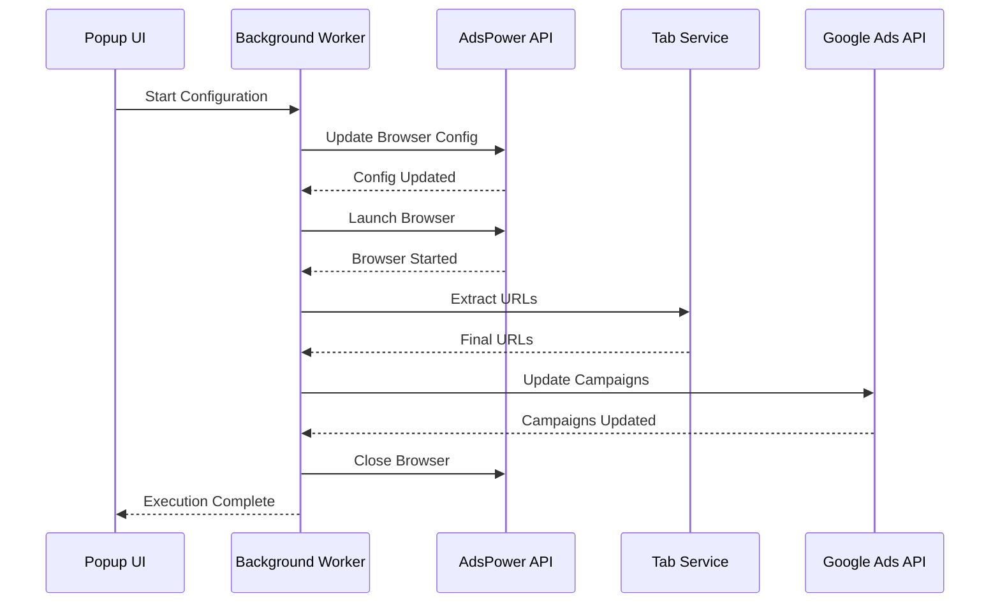

# Design Document

## Overview

The Google Ads Automation System is a comprehensive platform that automates promotional link tracking and Google Ads campaign management. The system resolves promotional links through AdsPower fingerprint browsers, extracts final destination URLs with parameters, and automatically updates Google Ads campaigns with the correct tracking information.

## Architecture

### System Architecture



### Technology Stack

- **Runtime**: Node.js 18+ with TypeScript
- **Web Framework**: Express.js with middleware architecture
- **Database**: SQLite with better-sqlite3 for performance
- **Task Queue**: Bull Queue with Redis for job management
- **Frontend**: Modern vanilla JavaScript with Web Components
- **HTTP Client**: Axios with retry and rate limiting
- **Logging**: Winston with structured JSON output
- **Configuration**: Environment-based with validation

## Components and Interfaces

### 1. Workflow Orchestrator

The central component that manages the entire automation workflow from link processing to Google Ads updates.

```typescript
interface WorkflowOrchestrator {
  executeTrackingJob(jobId: string): Promise<ExecutionResult>;
  scheduleRecurringJob(config: TrackingConfiguration): Promise<string>;
  cancelJob(jobId: string): Promise<boolean>;
  getJobStatus(jobId: string): Promise<JobStatus>;
}

class WorkflowOrchestratorImpl implements WorkflowOrchestrator {
  constructor(
    private linkProcessor: LinkProcessor,
    private adsManager: GoogleAdsManager,
    private emailService: EmailService,
    private scheduler: TaskScheduler
  ) {}
  
  async executeTrackingJob(jobId: string): Promise<ExecutionResult> {
    const config = await this.getConfiguration(jobId);
    const linkResults = await this.linkProcessor.processLinks(config.originalLinks, config.environmentId);
    const urlMappings = this.extractUrlMappings(linkResults);
    await this.adsManager.updateCampaigns(config.googleAdsAccounts, urlMappings);
    await this.emailService.sendReport(config.notificationEmail, linkResults);
    return this.buildExecutionResult(linkResults);
  }
}
```

### 2. Link Processor

Handles the core link tracking functionality using AdsPower browsers.

```typescript
interface LinkProcessor {
  processLinks(originalLinks: string[], environmentId: string): Promise<LinkResult[]>;
  processSingleLink(url: string, environmentId: string): Promise<LinkResult>;
}

class LinkProcessorImpl implements LinkProcessor {
  constructor(
    private adsPowerConnector: AdsPowerConnector,
    private tabExtractor: TabURLExtractor,
    private retryManager: RetryManager
  ) {}
  
  async processLinks(originalLinks: string[], environmentId: string): Promise<LinkResult[]> {
    const results: LinkResult[] = [];
    
    for (const link of originalLinks) {
      const result = await this.retryManager.executeWithRetry(
        () => this.processSingleLink(link, environmentId),
        'LINK_PROCESSING'
      );
      results.push(result);
      
      // Intelligent delay between links (35s + random 1-5s)
      await this.delay(35000 + Math.random() * 4000 + 1000);
    }
    
    return results;
  }
  
  async processSingleLink(url: string, environmentId: string): Promise<LinkResult> {
    // Update browser configuration
    await this.adsPowerConnector.updateBrowserConfig(environmentId, [url]);
    
    // Launch browser
    const browserSession = await this.adsPowerConnector.startBrowser(environmentId);
    
    try {
      // Wait for page load and extract final URL
      await this.delay(20000); // Wait 20 seconds for page to load
      const finalUrl = await this.tabExtractor.extractFinalUrl(browserSession.websocketUrl);
      
      return this.parseUrlResult(url, finalUrl);
    } finally {
      // Always close browser
      await this.adsPowerConnector.stopBrowser(environmentId);
    }
  }
  
  private parseUrlResult(originalUrl: string, finalUrl: string): LinkResult {
    const urlParts = finalUrl.split('?');
    return {
      originalUrl,
      finalUrl,
      finalUrlBase: urlParts[0], // Final URL (part before "?")
      finalUrlSuffix: urlParts[1] || '', // Final URL suffix (part after "?")
      timestamp: new Date(),
      status: 'success'
    };
  }
}
```

### 3. Google Ads Manager

Manages Google Ads API integration and campaign updates.

```typescript
interface GoogleAdsManager {
  updateCampaigns(accounts: GoogleAdsAccount[], urlMappings: UrlMapping[]): Promise<UpdateResult[]>;
  validateAccounts(accounts: GoogleAdsAccount[]): Promise<ValidationResult[]>;
}

class GoogleAdsManagerImpl implements GoogleAdsManager {
  constructor(
    private googleAdsClient: GoogleAdsAPIClient,
    private rateLimiter: RateLimiter
  ) {}
  
  async updateCampaigns(accounts: GoogleAdsAccount[], urlMappings: UrlMapping[]): Promise<UpdateResult[]> {
    const results: UpdateResult[] = [];
    
    for (const account of accounts) {
      await this.rateLimiter.waitForSlot();
      
      const campaigns = await this.googleAdsClient.getCampaigns(account.accountId);
      
      for (const campaign of campaigns) {
        const updates = this.findUpdatesForCampaign(campaign, urlMappings);
        if (updates.length > 0) {
          const result = await this.googleAdsClient.updateCampaignUrls(
            account.accountId,
            campaign.id,
            updates
          );
          results.push(result);
        }
      }
    }
    
    return results;
  }
  
  private findUpdatesForCampaign(campaign: Campaign, urlMappings: UrlMapping[]): CampaignUpdate[] {
    // Logic to match original URLs in campaign with new final URLs and ensure unique ad mapping
    return urlMappings
      .filter(mapping => campaign.ads.some(ad => ad.finalUrl.includes(mapping.originalUrlPattern)))
      .map(mapping => {
        const targetAd = campaign.ads.find(ad => ad.finalUrl.includes(mapping.originalUrlPattern));
        if (!targetAd) throw new Error(`No unique ad found for pattern: ${mapping.originalUrlPattern}`);
        
        return {
          adId: targetAd.id,
          finalUrl: mapping.finalUrlBase, // Final URL (part before "?")
          finalUrlSuffix: mapping.finalUrlSuffix // Final URL suffix (part after "?")
        };
      });
  }
}
```

### 4. Data Models

Core data structures that represent the system's domain objects.

```typescript
interface TrackingConfiguration {
  id: string;
  name: string;
  environmentId: string;
  repeatCount: number;
  notificationEmail: string;
  originalLinks: string[];
  googleAdsAccounts: GoogleAdsAccount[];
  schedulingConfig?: SchedulingConfig;
  status: 'active' | 'paused' | 'stopped';
  createdAt: Date;
  updatedAt: Date;
  lastExecuted?: Date;
}

interface GoogleAdsAccount {
  accountId: string;
  accountName: string;
  credentials: GoogleAdsCredentials;
  campaignMappings: CampaignMapping[];
}

interface CampaignMapping {
  campaignId: string;
  campaignName: string;
  originalUrlPattern: string; // Pattern to match original URLs
  adGroupMappings?: AdGroupMapping[];
}

interface LinkResult {
  originalUrl: string;
  finalUrl: string;
  finalUrlBase: string; // Final URL (part before "?")
  finalUrlSuffix: string; // Final URL suffix (part after "?")
  processingTime: number;
  attempts: number;
  status: 'success' | 'failed' | 'pending';
  error?: string;
  timestamp: Date;
}

interface ExecutionResult {
  configurationId: string;
  executionId: string;
  startTime: Date;
  endTime?: Date;
  status: 'running' | 'completed' | 'failed' | 'cancelled';
  processedLinks: LinkResult[];
  googleAdsUpdates: GoogleAdsUpdateResult[];
  errors: ExecutionError[];
  metrics: ExecutionMetrics;
}

interface ExecutionMetrics {
  totalLinks: number;
  successfulLinks: number;
  failedLinks: number;
  averageProcessingTime: number;
  totalGoogleAdsUpdates: number;
  successfulGoogleAdsUpdates: number;
  executionDuration: number;
}
```

### 5. Integration Connectors

#### AdsPower Connector

```typescript
interface AdsPowerConnector {
  updateBrowserConfig(environmentId: string, urls: string[]): Promise<void>;
  startBrowser(environmentId: string): Promise<BrowserSession>;
  stopBrowser(environmentId: string): Promise<void>;
  getBrowserStatus(environmentId: string): Promise<BrowserStatus>;
}

class AdsPowerConnectorImpl implements AdsPowerConnector {
  private readonly baseUrl = 'http://local.adspower.net:50325';
  
  constructor(private httpClient: HttpClient) {}
  
  async updateBrowserConfig(environmentId: string, urls: string[]): Promise<void> {
    await this.httpClient.post(`${this.baseUrl}/api/v1/user/update`, {
      user_id: environmentId,
      open_urls: urls
    });
  }
  
  async startBrowser(environmentId: string): Promise<BrowserSession> {
    const response = await this.httpClient.get(
      `${this.baseUrl}/api/v1/browser/start?user_id=${environmentId}`
    );
    
    return {
      environmentId,
      websocketUrl: response.data.ws.puppeteer,
      debuggerUrl: response.data.ws.selenium,
      sessionId: response.data.session_id
    };
  }
  
  async stopBrowser(environmentId: string): Promise<void> {
    await this.httpClient.get(
      `${this.baseUrl}/api/v1/browser/stop?user_id=${environmentId}`
    );
  }
}
```

#### Google Ads API Client

```typescript
interface GoogleAdsAPIClient {
  authenticate(credentials: GoogleAdsCredentials): Promise<void>;
  getCampaigns(accountId: string): Promise<Campaign[]>;
  updateCampaignUrls(accountId: string, updates: CampaignUrlUpdate[]): Promise<UpdateResult>;
  validateAccount(accountId: string): Promise<boolean>;
}

class GoogleAdsAPIClientImpl implements GoogleAdsAPIClient {
  private accessToken?: string;
  
  constructor(
    private httpClient: HttpClient,
    private rateLimiter: RateLimiter
  ) {}
  
  async authenticate(credentials: GoogleAdsCredentials): Promise<void> {
    // Implement OAuth 2.0 flow for Google Ads API
    const tokenResponse = await this.httpClient.post('https://oauth2.googleapis.com/token', {
      client_id: credentials.clientId,
      client_secret: credentials.clientSecret,
      refresh_token: credentials.refreshToken,
      grant_type: 'refresh_token'
    });
    
    this.accessToken = tokenResponse.data.access_token;
  }
  
  async updateCampaignUrls(accountId: string, updates: CampaignUrlUpdate[]): Promise<UpdateResult> {
    await this.rateLimiter.waitForSlot();
    
    const operations = updates.map(update => ({
      update: {
        resourceName: `customers/${accountId}/ads/${update.adId}`,
        finalUrls: [update.finalUrl], // Final URL (part before "?")
        finalUrlSuffix: update.finalUrlSuffix // Final URL suffix (part after "?")
      }
    }));
    
    const response = await this.httpClient.post(
      `https://googleads.googleapis.com/v14/customers/${accountId}/ads:mutate`,
      { operations },
      {
        headers: {
          'Authorization': `Bearer ${this.accessToken}`,
          'developer-token': process.env.GOOGLE_ADS_DEVELOPER_TOKEN
        }
      }
    );
    
    return {
      accountId,
      updatedAds: response.data.results.length,
      errors: response.data.partialFailureError ? [response.data.partialFailureError] : []
    };
  }
}
```

### 6. Task Scheduling and Queue Management

```typescript
interface TaskScheduler {
  scheduleRecurringTask(config: TrackingConfiguration): Promise<string>;
  scheduleOneTimeTask(configId: string, executeAt: Date): Promise<string>;
  cancelTask(taskId: string): Promise<boolean>;
  getTaskStatus(taskId: string): Promise<TaskStatus>;
}

class TaskSchedulerImpl implements TaskScheduler {
  constructor(
    private jobQueue: Queue,
    private configStorage: ConfigurationStorage
  ) {}
  
  async scheduleRecurringTask(config: TrackingConfiguration): Promise<string> {
    const job = await this.jobQueue.add(
      'execute-tracking-configuration',
      { configurationId: config.id },
      {
        repeat: this.buildCronPattern(config.schedulingConfig),
        jobId: `recurring-${config.id}`
      }
    );
    
    return job.id;
  }
  
  private buildCronPattern(schedulingConfig?: SchedulingConfig): string {
    if (!schedulingConfig) return '0 0 * * *'; // Daily at midnight
    
    // Convert scheduling config to cron pattern
    return `${schedulingConfig.minute} ${schedulingConfig.hour} * * ${schedulingConfig.dayOfWeek}`;
  }
}
```

## Error Handling

### Comprehensive Error Management Strategy

The system implements a multi-layered error handling approach that ensures robust operation even under adverse conditions.

```typescript
enum ErrorType {
  NETWORK_ERROR = 'NETWORK_ERROR',
  TIMEOUT_ERROR = 'TIMEOUT_ERROR',
  AUTHENTICATION_ERROR = 'AUTHENTICATION_ERROR',
  RATE_LIMIT_ERROR = 'RATE_LIMIT_ERROR',
  BROWSER_ERROR = 'BROWSER_ERROR',
  VALIDATION_ERROR = 'VALIDATION_ERROR',
  SYSTEM_ERROR = 'SYSTEM_ERROR'
}

interface RetryStrategy {
  maxRetries: number;
  baseDelay: number;
  multiplier: number;
  maxDelay: number;
}

class ErrorManager {
  private retryStrategies: Map<ErrorType, RetryStrategy> = new Map([
    [ErrorType.NETWORK_ERROR, { maxRetries: 3, baseDelay: 1000, multiplier: 2, maxDelay: 10000 }],
    [ErrorType.TIMEOUT_ERROR, { maxRetries: 2, baseDelay: 5000, multiplier: 1.5, maxDelay: 15000 }],
    [ErrorType.BROWSER_ERROR, { maxRetries: 2, baseDelay: 3000, multiplier: 2, maxDelay: 12000 }],
    [ErrorType.RATE_LIMIT_ERROR, { maxRetries: 5, baseDelay: 60000, multiplier: 1, maxDelay: 60000 }],
    [ErrorType.AUTHENTICATION_ERROR, { maxRetries: 1, baseDelay: 5000, multiplier: 1, maxDelay: 5000 }]
  ]);

  async executeWithRetry<T>(
    operation: () => Promise<T>,
    errorType: ErrorType,
    context: string
  ): Promise<T> {
    const strategy = this.retryStrategies.get(errorType);
    if (!strategy) throw new Error(`No retry strategy for ${errorType}`);

    let lastError: Error;
    
    for (let attempt = 0; attempt <= strategy.maxRetries; attempt++) {
      try {
        return await operation();
      } catch (error) {
        lastError = error as Error;
        
        if (attempt === strategy.maxRetries) break;
        
        const delay = Math.min(
          strategy.baseDelay * Math.pow(strategy.multiplier, attempt),
          strategy.maxDelay
        );
        
        await this.delay(delay);
      }
    }
    
    throw new Error(`Operation failed after ${strategy.maxRetries + 1} attempts: ${lastError.message}`);
  }
  
  private delay(ms: number): Promise<void> {
    return new Promise(resolve => setTimeout(resolve, ms));
  }
}
```

### Error Recovery Mechanisms

1. **AdsPower Browser Recovery**: Automatic browser environment restart and cleanup
2. **Google Ads API Recovery**: Token refresh and alternative endpoint usage
3. **Data Integrity Recovery**: Transaction rollback and checkpoint restoration
4. **Workflow Recovery**: Partial execution resumption from last successful step

## Testing Strategy

### Unit Testing
- **Framework**: Jest with Chrome Extension testing utilities
- **Coverage**: All business logic components
- **Mocking**: External API calls and browser APIs
- **Validation**: Input validation and error handling

### Integration Testing
- **API Testing**: Mock AdsPower and Google Ads APIs
- **Browser Testing**: Headless Chrome automation
- **Storage Testing**: Chrome storage API validation
- **End-to-End**: Complete workflow testing

### Performance Testing
- **Load Testing**: Multiple concurrent configurations
- **Memory Testing**: Long-running operation monitoring
- **Network Testing**: Various connection conditions
- **Browser Testing**: Resource usage optimization

### Security Testing
- **Data Encryption**: Configuration and credential security
- **API Security**: Token management and validation
- **Input Validation**: XSS and injection prevention
- **Permission Testing**: Chrome extension permissions

## Data Flow Architecture

### Configuration Workflow


### Execution Workflow


## Security Considerations

### Data Protection
- **Encryption**: AES-256 for sensitive configuration data
- **Storage**: Chrome's secure storage APIs
- **Transmission**: HTTPS for all external communications
- **Credentials**: Secure token storage with expiration

### Access Control
- **Permissions**: Minimal required Chrome extension permissions
- **API Access**: OAuth 2.0 for Google Ads integration
- **Local Access**: Restricted to extension context only
- **Network Access**: Whitelist-based external connections

### Privacy Protection
- **Data Minimization**: Store only necessary information
- **Data Retention**: Configurable cleanup policies
- **User Control**: Export and delete capabilities
- **Audit Logging**: Comprehensive activity tracking

## Performance Optimization

### Resource Management
- **Memory**: Efficient object lifecycle management
- **CPU**: Asynchronous operations with proper queuing
- **Network**: Connection pooling and request batching
- **Storage**: Indexed data structures for fast retrieval

### Scalability Considerations
- **Concurrent Operations**: Configurable parallel execution limits
- **Queue Management**: Priority-based operation scheduling
- **Rate Limiting**: Adaptive throttling based on API responses
- **Caching**: Intelligent caching of frequently accessed data

### Monitoring and Metrics
- **Performance Metrics**: Operation timing and success rates
- **Resource Usage**: Memory and CPU utilization tracking
- **Error Rates**: Categorized error frequency analysis
- **User Experience**: Response time and interaction metrics