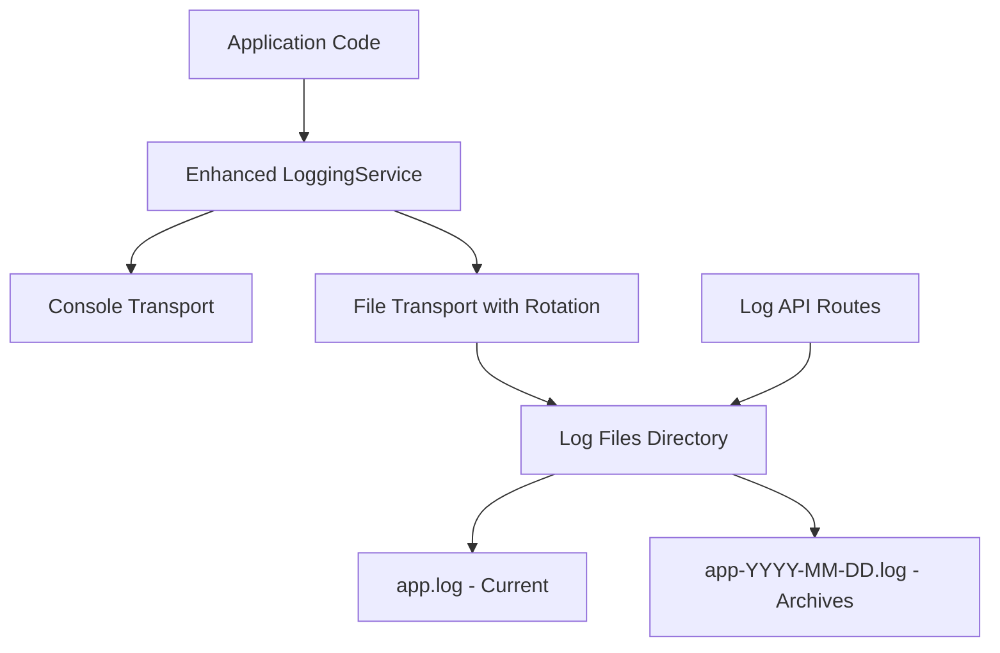

# Design Document

## Overview

The logging system design builds upon the existing LoggingService infrastructure to provide comprehensive log management with file persistence, rotation, and a real-time web interface. The system follows a layered architecture with clear separation between log collection, storage, and presentation layers.

## Architecture

### Simplified Architecture



### Simplified Component Layers

1. **Collection Layer**: Enhanced existing LoggingService with file rotation
2. **Storage Layer**: Simple file system with daily rotation and cleanup
3. **API Layer**: Basic REST endpoints for log reading and stats

## Components and Interfaces

### 1. Enhanced File Transport with Rotation

```typescript
interface RotatingFileTransport extends LogTransport {
  maxFileSize: number;
  maxFiles: number;
  retentionDays: number;
  logDirectory: string;
  
  rotate(): Promise<void>;
  cleanup(): Promise<void>;
  getLogFiles(): Promise<LogFileInfo[]>;
}

interface LogFileInfo {
  filename: string;
  path: string;
  size: number;
  createdAt: Date;
  modifiedAt: Date;
  isCurrent: boolean;
}
```

### 2. Simple Real-time Updates via HTTP Polling

Instead of WebSocket complexity, use simple HTTP polling every 2-3 seconds to fetch new log entries. This is more stable and easier to implement.

### 3. Log Query Service

```typescript
interface LogQueryService {
  searchLogs(criteria: LogSearchCriteria): Promise<LogSearchResult>;
  getLogFiles(): Promise<LogFileInfo[]>;
  getLogStatistics(timeRange: TimeRange): Promise<LogStatistics>;
  streamLogs(criteria: LogSearchCriteria): AsyncIterable<LogEntry>;
}

interface LogSearchCriteria {
  level?: LogLevel[];
  startTime?: Date;
  endTime?: Date;
  searchText?: string;
  context?: string;
  limit?: number;
  offset?: number;
  sortOrder?: 'asc' | 'desc';
}

interface LogSearchResult {
  entries: LogEntry[];
  totalCount: number;
  hasMore: boolean;
}

interface LogStatistics {
  totalLogs: number;
  logsByLevel: Record<LogLevel, number>;
  logsByHour: Array<{ hour: string; count: number }>;
  topContexts: Array<{ context: string; count: number }>;
}
```


## Data Models

### Enhanced Log Entry

```typescript
interface EnhancedLogEntry extends LogEntry {
  id: string;
  source: 'application' | 'system' | 'error';
  tags?: string[];
  duration?: number;
  traceId?: string;
  spanId?: string;
}
```

### Log File Management

```typescript
interface LogFileManager {
  currentLogFile: string;
  archiveDirectory: string;
  maxFileSize: number;
  retentionDays: number;
  
  getCurrentLogPath(): string;
  getArchiveLogPaths(): Promise<string[]>;
  rotateIfNeeded(): Promise<boolean>;
  cleanupOldLogs(): Promise<number>;
}
```

### Statistics Data Models

```typescript
interface TimeSeriesData {
  timestamp: Date;
  value: number;
  level?: LogLevel;
}

interface LogTrendData {
  hourly: TimeSeriesData[];
  daily: TimeSeriesData[];
  byLevel: Record<LogLevel, TimeSeriesData[]>;
}
```

## Error Handling

### Graceful Degradation Strategy

1. **File System Errors**: Continue logging to console if file operations fail
2. **WebSocket Errors**: Maintain log functionality even if real-time streaming fails
3. **Query Errors**: Return partial results with error indicators
4. **Rotation Errors**: Skip rotation but continue logging to current file

### Error Recovery Mechanisms

```typescript
interface ErrorRecoveryStrategy {
  maxRetries: number;
  backoffMultiplier: number;
  fallbackTransports: LogTransport[];
  
  handleFileSystemError(error: Error): Promise<void>;
  handleWebSocketError(error: Error): Promise<void>;
  handleQueryError(error: Error): Promise<LogSearchResult>;
}
```

## Testing Strategy

### Unit Testing

1. **Transport Layer Tests**
   - File rotation logic
   - WebSocket broadcasting
   - Error handling scenarios

2. **Service Layer Tests**
   - Log query functionality
   - Statistics calculation
   - File management operations

3. **Component Tests**
   - Log viewer rendering
   - Real-time updates
   - Search and filtering

### Integration Testing

1. **End-to-End Log Flow**
   - Application log → File storage → Web display
   - Real-time streaming functionality
   - File rotation and cleanup

2. **Performance Testing**
   - High-volume log handling
   - WebSocket connection limits
   - Query performance with large log files

3. **Error Scenario Testing**
   - Disk space exhaustion
   - File permission issues
   - Network connectivity problems

### Test Data Management

```typescript
interface LogTestDataFactory {
  createLogEntry(overrides?: Partial<LogEntry>): LogEntry;
  createLogFile(entryCount: number): Promise<string>;
  createTimeSeriesData(duration: number): TimeSeriesData[];
  cleanupTestFiles(): Promise<void>;
}
```

## Performance Considerations

### File I/O Optimization

1. **Buffered Writing**: Batch log writes to reduce I/O operations
2. **Async Operations**: Non-blocking file operations
3. **Memory Management**: Limit in-memory log buffer size


### Query Performance

1. **Indexing Strategy**: Time-based indexing for log files
2. **Streaming Queries**: Process large result sets incrementally
3. **Caching**: Cache frequently accessed statistics

## Security Considerations

### Data Protection

1. **Sensitive Data Filtering**: Extend existing SENSITIVE_FIELDS configuration
2. **Audit Logging**: Log access to the logging system itself

## Configuration

### Environment Variables

```bash
# Log file configuration
LOG_DIRECTORY=./logs
LOG_MAX_FILE_SIZE=10485760  # 10MB
LOG_RETENTION_DAYS=7
LOG_MAX_FILES=50

# Real-time logging
LOG_POLLING_INTERVAL=3000  # 3 seconds

# Performance tuning
LOG_BUFFER_SIZE=1000
LOG_FLUSH_INTERVAL=5000
MAX_DISPLAYED_LOGS=1000
```

### Runtime Configuration

```typescript
interface LoggingSystemConfig {
  fileRotation: {
    maxFileSize: number;
    retentionDays: number;
    maxFiles: number;
  };
  realtime: {
    enabled: boolean;
    maxClients: number;
    bufferSize: number;
  };
  query: {
    maxResultSize: number;
    defaultPageSize: number;
    cacheTimeout: number;
  };
}
```

## Deployment Considerations

### File System Requirements

1. **Directory Structure**: Ensure logs directory exists and is writable
2. **Disk Space Monitoring**: Alert when disk usage exceeds thresholds
3. **Backup Strategy**: Consider log backup for critical environments

### Docker Integration

1. **Volume Mounting**: Mount logs directory for persistence
2. **Log Aggregation**: Compatible with Docker logging drivers
3. **Health Checks**: Monitor logging system health

### Monitoring and Alerting

1. **System Metrics**: Track log volume, error rates, and performance
2. **Health Endpoints**: Provide status endpoints for monitoring systems
3. **Alert Conditions**: Define alerts for logging system failures