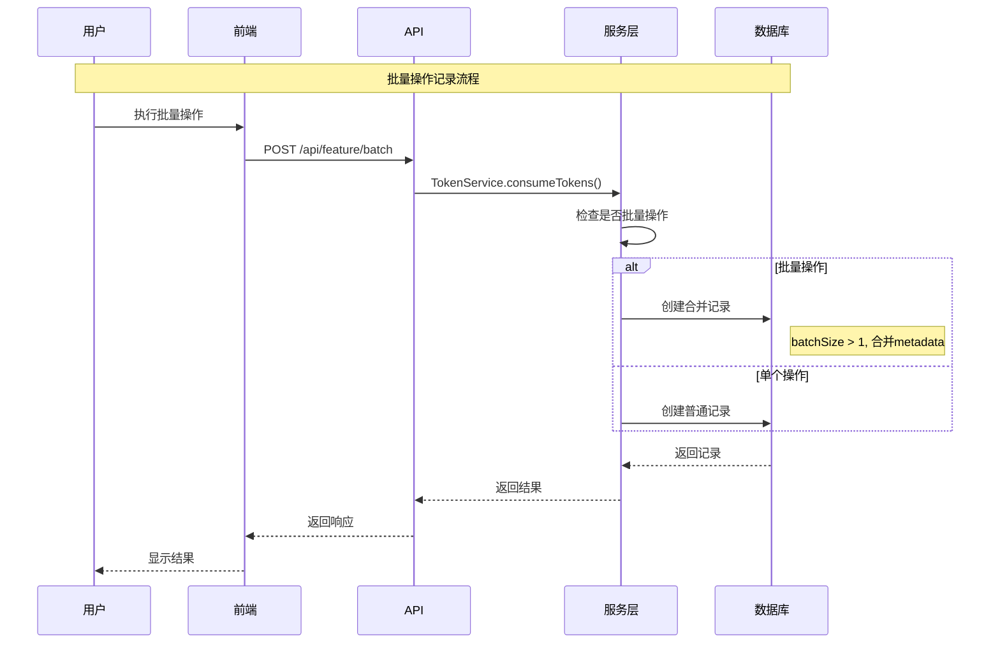

# Token消耗记录管理系统 - 设计文档

## 概述

基于现有的TokenUsage和TokenConfig模型，设计一个完善的Token消耗记录管理系统。系统将重点解决批量操作记录合并显示问题，并提供灵活的Token配置管理功能。

## 架构设计

### 系统架构图

```mermaid
graph TB
    subgraph "前端层"
        A[用户个人中心] --> B[Token消耗记录页面]
        C[管理员后台] --> D[Token配置管理页面]
    end
    
    subgraph "API层"
        E[用户Token API] --> F[/api/user/tokens/*]
        G[管理员Token API] --> H[/api/admin/token-config/*]
    end
    
    subgraph "服务层"
        I[TokenConsumptionService] --> J[批量操作合并逻辑]
        K[TokenConfigService] --> L[配置管理逻辑]
        M[TokenService] --> N[现有Token服务]
    end
    
    subgraph "数据层"
        O[(TokenUsage表)] --> P[消耗记录存储]
        Q[(TokenConfig表)] --> R[配置规则存储]
        S[(TokenConfigHistory表)] --> T[配置变更历史]
    end
    
    B --> F
    D --> H
    F --> I
    H --> K
    I --> O
    K --> Q
    K --> S
```

### 数据流设计



## 组件设计

### 数据库模型增强

#### 1. TokenUsage表优化（已存在，需增强）

```typescript
model TokenUsage {
  id        String   @id @default(cuid())
  userId    String
  feature   String   // 功能: siterank, batchopen, adscenter
  action    String   // 操作: domain_analysis, url_access, link_replace
  amount    Int      // Token消耗数量
  balance   Int      // 操作后余额
  
  // 批量操作字段（新增）
  batchId   String?  // 批量操作ID
  batchSize Int?     // 批量操作数量
  isBatch   Boolean  @default(false) // 是否为批量操作
  
  // 元数据和详情
  metadata  Json?    // 操作元数据
  details   Json?    // 操作详细信息
  
  timestamp DateTime @default(now())
  
  user User @relation("TokenUsages", fields: [userId], references: [id])
  
  @@index([userId, timestamp])
  @@index([feature, timestamp])
  @@index([batchId]) // 新增批量操作索引
  @@index([userId, isBatch, timestamp]) // 新增复合索引
}
```

#### 2. TokenConfig表（已存在）

```typescript
model TokenConfig {
  id          String   @id @default(cuid())
  feature     String   // 功能名称
  action      String   // 操作名称
  cost        Int      // Token消耗数量
  description String   @default("")
  isActive    Boolean  @default(true)
  createdAt   DateTime @default(now())
  updatedAt   DateTime @updatedAt
  
  // 关联配置历史
  history TokenConfigHistory[]
  
  @@unique([feature, action])
  @@index([feature])
  @@index([isActive])
}
```

#### 3. TokenConfigHistory表（新增）

```typescript
model TokenConfigHistory {
  id            String   @id @default(cuid())
  configId      String
  feature       String
  action        String
  oldCost       Int?     // 原消耗数量
  newCost       Int      // 新消耗数量
  changeReason  String?  // 变更原因
  changedBy     String   // 变更人ID
  changedAt     DateTime @default(now())
  
  // 关联
  config  TokenConfig @relation(fields: [configId], references: [id])
  changer User        @relation(fields: [changedBy], references: [id])
  
  @@index([configId, changedAt])
  @@index([feature, changedAt])
}
```

### 服务层设计

#### 1. TokenConsumptionService（新增）

```typescript
export class TokenConsumptionService {
  // 批量操作记录合并
  static async recordBatchUsage(params: {
    userId: string
    feature: string
    action: string
    operations: Array<{
      metadata: any
      amount: number
    }>
  }): Promise<TokenUsageRecord>
  
  // 获取用户消耗记录（支持批量合并显示）
  static async getUserUsageHistory(params: {
    userId: string
    feature?: string
    startDate?: Date
    endDate?: Date
    page: number
    limit: number
  }): Promise<{
    records: TokenUsageRecord[]
    total: number
    hasMore: boolean
  }>
  
  // 获取批量操作详情
  static async getBatchOperationDetails(batchId: string): Promise<{
    operations: Array<{
      metadata: any
      amount: number
      timestamp: Date
    }>
    summary: {
      totalAmount: number
      operationCount: number
      feature: string
      action: string
    }
  }>
}
```

#### 2. TokenConfigService（新增）

```typescript
export class TokenConfigService {
  // 获取所有配置
  static async getAllConfigs(): Promise<TokenConfig[]>
  
  // 更新配置
  static async updateConfig(params: {
    id: string
    cost: number
    description?: string
    isActive?: boolean
    changedBy: string
    changeReason?: string
  }): Promise<TokenConfig>
  
  // 批量更新配置
  static async batchUpdateConfigs(updates: Array<{
    id: string
    cost: number
    changedBy: string
    changeReason?: string
  }>): Promise<{
    updated: number
    failed: string[]
  }>
  
  // 获取配置变更历史
  static async getConfigHistory(configId?: string): Promise<TokenConfigHistory[]>
  
  // 获取实时配置（带缓存）
  static async getActiveConfig(feature: string, action: string): Promise<number>
}
```

### API设计

#### 1. 用户端API

##### GET /api/user/tokens/usage
```typescript
// 请求参数
interface UsageQueryParams {
  page?: number
  limit?: number
  feature?: string
  startDate?: string
  endDate?: string
  includeBatchDetails?: boolean
}

// 响应格式
interface UsageResponse {
  success: boolean
  data: {
    records: Array<{
      id: string
      feature: string
      action: string
      amount: number
      description: string
      isBatch: boolean
      batchSize?: number
      batchId?: string
      timestamp: string
      metadata?: any
    }>
    pagination: {
      page: number
      limit: number
      total: number
      totalPages: number
      hasMore: boolean
    }
    summary: {
      totalAmount: number
      totalOperations: number
      byFeature: Record<string, {
        amount: number
        operations: number
      }>
    }
  }
}
```

##### GET /api/user/tokens/batch/{batchId}
```typescript
// 获取批量操作详情
interface BatchDetailResponse {
  success: boolean
  data: {
    batchId: string
    feature: string
    action: string
    totalAmount: number
    operationCount: number
    timestamp: string
    operations: Array<{
      metadata: any
      amount: number
      description: string
    }>
  }
}
```

#### 2. 管理端API

##### GET /api/admin/token-config
```typescript
// 响应格式
interface ConfigListResponse {
  success: boolean
  data: {
    configs: Array<{
      id: string
      feature: string
      action: string
      cost: number
      description: string
      isActive: boolean
      createdAt: string
      updatedAt: string
      lastChangedBy?: string
      lastChangeReason?: string
    }>
  }
}
```

##### PUT /api/admin/token-config/{id}
```typescript
// 请求体
interface ConfigUpdateRequest {
  cost: number
  description?: string
  isActive?: boolean
  changeReason?: string
}

// 响应格式
interface ConfigUpdateResponse {
  success: boolean
  data: {
    config: TokenConfig
    historyRecord: TokenConfigHistory
  }
}
```

##### GET /api/admin/token-config/history
```typescript
// 请求参数
interface HistoryQueryParams {
  configId?: string
  feature?: string
  startDate?: string
  endDate?: string
  page?: number
  limit?: number
}

// 响应格式
interface HistoryResponse {
  success: boolean
  data: {
    records: Array<{
      id: string
      feature: string
      action: string
      oldCost: number | null
      newCost: number
      changeReason: string | null
      changedBy: string
      changerName: string
      changedAt: string
    }>
    pagination: {
      page: number
      total: number
      totalPages: number
    }
  }
}
```

### 前端组件设计

#### 1. 用户端组件

##### TokenUsageHistory组件
```typescript
interface TokenUsageHistoryProps {
  userId: string
  initialData?: UsageResponse
}

// 功能特性：
// - 分页加载消耗记录
// - 批量操作合并显示
// - 筛选功能（功能类型、时间范围）
// - 批量操作详情展开
// - 响应式设计
```

##### TokenUsageStats组件
```typescript
interface TokenUsageStatsProps {
  userId: string
  timeRange: '7d' | '30d' | '90d' | 'all'
}

// 功能特性：
// - 消耗趋势图表
// - 功能使用分布
// - 统计数据概览
// - 数据导出功能
```

##### BatchOperationDetail组件
```typescript
interface BatchOperationDetailProps {
  batchId: string
  onClose: () => void
}

// 功能特性：
// - 批量操作详情展示
// - 操作列表分页
// - 操作元数据展示
// - 模态框形式展示
```

#### 2. 管理端组件

##### TokenConfigManagement组件
```typescript
interface TokenConfigManagementProps {
  initialConfigs?: TokenConfig[]
}

// 功能特性：
// - 配置列表展示
// - 内联编辑功能
// - 批量操作支持
// - 配置状态切换
// - 实时生效提示
```

##### TokenConfigHistory组件
```typescript
interface TokenConfigHistoryProps {
  configId?: string
}

// 功能特性：
// - 配置变更历史
// - 变更对比视图
// - 筛选和搜索
// - 变更影响分析
```

## 错误处理

### 1. 数据一致性处理

```typescript
// 批量操作事务处理
async function recordBatchUsageWithTransaction(params: BatchUsageParams) {
  return await prisma.$transaction(async (tx) => {
    // 1. 检查Token余额
    const balance = await tx.user.findUnique({
      where: { id: params.userId },
      select: { tokenBalance: true }
    })
    
    if (!balance || balance.tokenBalance < params.totalAmount) {
      throw new Error('Insufficient token balance')
    }
    
    // 2. 扣除Token
    await tx.user.update({
      where: { id: params.userId },
      data: { tokenBalance: { decrement: params.totalAmount } }
    })
    
    // 3. 创建使用记录
    const usage = await tx.tokenUsage.create({
      data: {
        userId: params.userId,
        feature: params.feature,
        action: params.action,
        amount: params.totalAmount,
        batchId: params.batchId,
        batchSize: params.operations.length,
        isBatch: true,
        metadata: {
          operations: params.operations,
          batchInfo: {
            totalOperations: params.operations.length,
            averageAmount: params.totalAmount / params.operations.length
          }
        }
      }
    })
    
    return usage
  })
}
```

### 2. 配置变更处理

```typescript
// 配置更新带历史记录
async function updateConfigWithHistory(params: ConfigUpdateParams) {
  return await prisma.$transaction(async (tx) => {
    // 1. 获取当前配置
    const currentConfig = await tx.tokenConfig.findUnique({
      where: { id: params.id }
    })
    
    if (!currentConfig) {
      throw new Error('Config not found')
    }
    
    // 2. 更新配置
    const updatedConfig = await tx.tokenConfig.update({
      where: { id: params.id },
      data: {
        cost: params.cost,
        description: params.description,
        isActive: params.isActive,
        updatedAt: new Date()
      }
    })
    
    // 3. 记录变更历史
    const historyRecord = await tx.tokenConfigHistory.create({
      data: {
        configId: params.id,
        feature: currentConfig.feature,
        action: currentConfig.action,
        oldCost: currentConfig.cost,
        newCost: params.cost,
        changeReason: params.changeReason,
        changedBy: params.changedBy
      }
    })
    
    // 4. 清除配置缓存
    await clearConfigCache(currentConfig.feature, currentConfig.action)
    
    return { config: updatedConfig, history: historyRecord }
  })
}
```

## 测试策略

### 1. 单元测试

```typescript
// TokenConsumptionService测试
describe('TokenConsumptionService', () => {
  describe('recordBatchUsage', () => {
    it('should create merged record for batch operations', async () => {
      // 测试批量操作记录合并
    })
    
    it('should handle insufficient balance', async () => {
      // 测试余额不足处理
    })
  })
  
  describe('getUserUsageHistory', () => {
    it('should return paginated usage records', async () => {
      // 测试分页查询
    })
    
    it('should merge batch operations in display', async () => {
      // 测试批量操作合并显示
    })
  })
})
```

### 2. 集成测试

```typescript
// API集成测试
describe('Token Usage API', () => {
  it('should handle batch operation recording end-to-end', async () => {
    // 端到端批量操作测试
  })
  
  it('should maintain data consistency during concurrent operations', async () => {
    // 并发操作一致性测试
  })
})
```

### 3. 性能测试

```typescript
// 性能测试场景
describe('Performance Tests', () => {
  it('should handle large batch operations efficiently', async () => {
    // 大批量操作性能测试
  })
  
  it('should query usage history with acceptable response time', async () => {
    // 查询性能测试
  })
})
```

## 缓存策略

### 1. Token配置缓存

```typescript
// Redis缓存配置
const CONFIG_CACHE_KEY = 'token:config'
const CONFIG_CACHE_TTL = 300 // 5分钟

class TokenConfigCache {
  static async getConfig(feature: string, action: string): Promise<number | null> {
    const cacheKey = `${CONFIG_CACHE_KEY}:${feature}:${action}`
    const cached = await redis.get(cacheKey)
    
    if (cached) {
      return parseInt(cached)
    }
    
    // 从数据库获取并缓存
    const config = await prisma.tokenConfig.findFirst({
      where: { feature, action, isActive: true }
    })
    
    if (config) {
      await redis.setex(cacheKey, CONFIG_CACHE_TTL, config.cost.toString())
      return config.cost
    }
    
    return null
  }
  
  static async clearCache(feature: string, action: string): Promise<void> {
    const cacheKey = `${CONFIG_CACHE_KEY}:${feature}:${action}`
    await redis.del(cacheKey)
  }
}
```

### 2. 用户统计缓存

```typescript
// 用户统计数据缓存
const STATS_CACHE_KEY = 'token:stats'
const STATS_CACHE_TTL = 600 // 10分钟

class TokenStatsCache {
  static async getUserStats(userId: string, timeRange: string): Promise<any | null> {
    const cacheKey = `${STATS_CACHE_KEY}:${userId}:${timeRange}`
    const cached = await redis.get(cacheKey)
    
    if (cached) {
      return JSON.parse(cached)
    }
    
    return null
  }
  
  static async setUserStats(userId: string, timeRange: string, stats: any): Promise<void> {
    const cacheKey = `${STATS_CACHE_KEY}:${userId}:${timeRange}`
    await redis.setex(cacheKey, STATS_CACHE_TTL, JSON.stringify(stats))
  }
}
```

## 安全考虑

### 1. 权限控制

```typescript
// 用户权限验证
async function validateUserAccess(userId: string, requestedUserId: string): Promise<boolean> {
  // 用户只能访问自己的记录
  return userId === requestedUserId
}

// 管理员权限验证
async function validateAdminAccess(userId: string): Promise<boolean> {
  const user = await prisma.user.findUnique({
    where: { id: userId },
    select: { role: true }
  })
  
  return user?.role === 'ADMIN' || user?.role === 'SUPER_ADMIN'
}
```

### 2. 数据验证

```typescript
// 输入数据验证
const configUpdateSchema = z.object({
  cost: z.number().min(1).max(1000),
  description: z.string().max(500).optional(),
  isActive: z.boolean().optional(),
  changeReason: z.string().max(200).optional()
})

// API参数验证
function validateConfigUpdate(data: any): ConfigUpdateRequest {
  return configUpdateSchema.parse(data)
}
```

## 监控和日志

### 1. 操作日志

```typescript
// 关键操作日志记录
async function logConfigChange(params: {
  configId: string
  changedBy: string
  oldValue: number
  newValue: number
  changeReason?: string
}) {
  await prisma.auditLog.create({
    data: {
      action: 'TOKEN_CONFIG_UPDATE',
      userId: params.changedBy,
      resourceType: 'TOKEN_CONFIG',
      resourceId: params.configId,
      metadata: {
        oldValue: params.oldValue,
        newValue: params.newValue,
        changeReason: params.changeReason
      }
    }
  })
}
```

### 2. 性能监控

```typescript
// API响应时间监控
async function monitorApiPerformance(endpoint: string, duration: number) {
  if (duration > 1000) { // 超过1秒记录警告
    console.warn(`Slow API response: ${endpoint} took ${duration}ms`)
    
    // 发送到监控系统
    await sendMetric('api.slow_response', {
      endpoint,
      duration,
      timestamp: new Date()
    })
  }
}
```

这个设计文档提供了完整的技术架构和实现方案，确保系统能够高效处理批量操作记录合并，并提供灵活的Token配置管理功能。