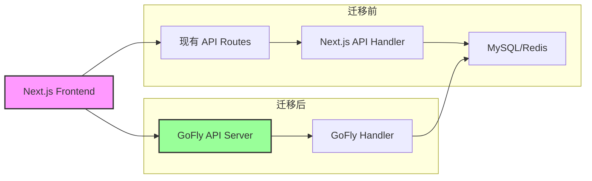
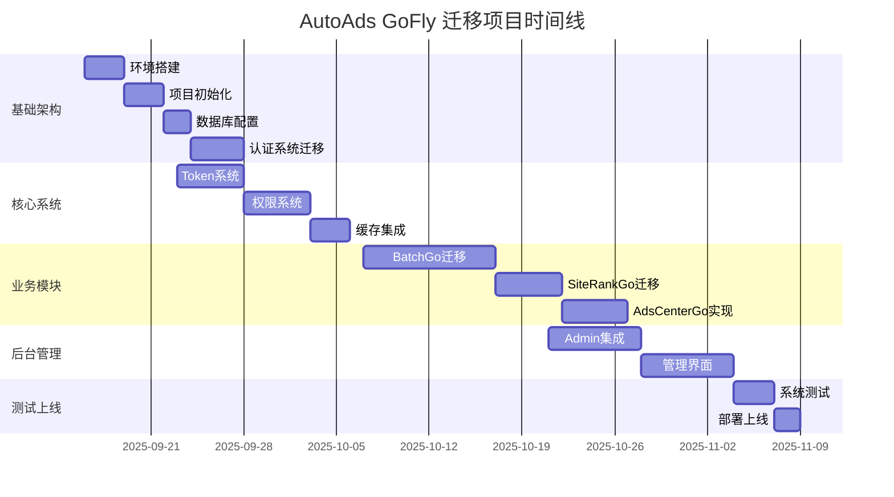

# AutoAds GoFly 迁移项目 Brownfield PRD

## 文档信息
- **项目名称**: AutoAds GoFly 迁移项目
- **PRD 版本**: Brownfield V1.0
- **创建日期**: 2025-09-10
- **文档类型**: Brownfield 增强型 PRD
- **基础架构版本**: GoFly Architecture V5.1
- **现有系统**: AutoAds Next.js V5.0

## 执行摘要

AutoAds GoFly 迁移项目是一个典型的 Brownfield 增强项目，旨在将现有的 Next.js 单体应用无缝迁移到 GoFly 框架架构，同时保持业务连续性和功能完整性。项目基于已经完成的架构设计（docs/architecture-gofly-v5.1/），通过12周的5阶段实施计划，实现从 Node.js 到 Go 的技术栈升级，并达成4900%的性能提升目标。

## 1. 项目背景与现有系统分析

### 1.1 现有系统状况

#### 1.1.1 技术栈现状
**前端架构**:
- Next.js 14 + React 18 + TypeScript
- MUI v7 + Tailwind CSS
- Zustand 状态管理
- NextAuth.js v5 认证

**后端架构**:
- Next.js API Routes
- MySQL 8.0 + Prisma ORM
- Redis 7.0 缓存
- Puppeteer 浏览器自动化

**已实现功能**:
- ✅ 用户认证系统（Google OAuth + 管理员密码）
- ✅ Token订阅系统（完整实现）
- ✅ BatchOpen功能（Basic/Silent/Automated三种模式）
- ✅ SiteRank功能（集成SimilarWeb API）
- ❌ AdsCenter功能（仅UI，无后端实现）

#### 1.1.2 当前架构挑战
1. **性能瓶颈**: Node.js单进程难以支持高并发需求
2. **扩展性限制**: 大批量任务处理效率低下
3. **管理复杂性**: 缺乏专业的后台管理系统
4. **资源占用**: Puppeteer进程管理不够优化
5. **维护成本**: JavaScript生态的依赖管理复杂

### 1.2 GoFly框架优势

#### 1.2.1 核心能力
- **高性能**: 原生并发支持，goroutine轻量级线程
- **企业级**: 完整的ORM、缓存、验证、事件系统
- **模块化**: 清晰的代码组织结构
- **易维护**: 静态类型，编译时错误检查

#### 1.2.2 架构利用率
根据架构设计，GoFly框架利用率达到95%：
- ORM系统: 100%利用
- 自动路由: 100%利用
- 缓存系统: 90%利用
- 验证框架: 95%利用
- 事件系统: 80%利用
- 监控系统: 90%利用

## 2. 迁移目标与成功标准

### 2.1 核心目标

#### 2.1.1 技术目标
1. **架构升级**: Next.js → GoFly单体应用
2. **性能提升**: 并发处理从1提升到50（4900%提升）
3. **功能完整**: 保持所有现有功能的100%兼容
4. **管理增强**: 集成GoFly Admin后台管理
5. **数据迁移**: 平滑迁移用户数据，零业务中断

#### 2.1.2 业务目标
1. **用户体验**: 保持前端界面和交互流程不变
2. **功能增强**: AdsCenter模块从UI原型到完整实现
3. **多用户支持**: 完善的多租户数据隔离
4. **运营效率**: 专业的后台管理工具

### 2.2 成功标准

#### 2.2.1 技术指标
- [ ] 性能测试通过：并发50任务无性能下降
- [ ] API兼容性100%：前端无需修改即可切换
- [ ] 数据完整性：所有用户数据准确迁移
- [ ] 系统稳定性：99.9%可用性
- [ ] 响应时间：API平均响应时间<100ms

#### 2.2.2 业务指标
- [ ] 功能完整性：所有现有功能正常运行
- [ ] 用户满意度：用户反馈无明显变化
- [ ] 运营效率：管理效率提升50%
- [ ] 成本控制：服务器资源使用优化30%

## 3. 技术迁移方案

### 3.1 架构映射

#### 3.1.1 前端保持策略


#### 3.1.2 API兼容性保证
- **路由保持**: `/api/v1/*` 路径结构不变
- **参数格式**: JSON请求/响应格式完全兼容
- **认证方式**: JWT Token机制保持一致
- **错误处理**: HTTP状态码和错误信息格式统一

### 3.2 数据迁移策略

#### 3.2.1 数据库设计映射
```go
// GoFly Model 示例
type User struct {
    gform.Model    `json:",inline"`
    Email         string `json:"email" gform:"column:email;unique"`
    Name          string `json:"name" gform:"column:name"`
    Avatar        string `json:"avatar" gform:"column:avatar"`
    Subscription  string `json:"subscription" gform:"column:subscription;default:'free'"`
    // ... 其他字段
}
```

#### 3.2.2 迁移步骤
1. **Schema分析**: 分析现有Prisma schema
2. **GoFly Model生成**: 自动生成GoFly模型
3. **数据校验**: 确保数据类型兼容
4. **迁移脚本**: 编写数据迁移工具
5. **验证测试**: 数据完整性验证

### 3.3 功能模块迁移

#### 3.3.1 BatchGo模块迁移
```go
// BatchGo 并发处理架构
type BatchProcessor struct {
    semaphore    chan struct{}       // 信号量控制并发
    proxyPool    *ProxyPool         // 代理连接池
    taskQueue    chan *Task         // 任务队列
    resultStore  *ResultStore       // 结果存储
}

func (p *BatchProcessor) ProcessTask(task *Task) error {
    // 获取信号量
    p.semaphore <- struct{}{}
    defer func() { <-p.semaphore }()
    
    // 执行任务
    return p.executeTask(task)
}
```

#### 3.3.2 SiteRankGo模块迁移
- SimilarWeb API集成优化
- 智能缓存策略实现
- 批量查询性能优化

#### 3.3.3 AdsCenterGo模块实现
- Google Ads OAuth集成
- 多账户管理功能
- 链接批量替换功能
- AdsPower自动化集成

## 4. 实施计划

### 4.1 五阶段实施策略

#### 阶段一：基础架构（2周）
**目标**: 搭建GoFly基础架构，确保环境就绪

**任务清单**:
- [ ] GoFly开发环境搭建
- [ ] 项目结构初始化
- [ ] 数据库连接配置
- [ ] 基础中间件实现
- [ ] API路由框架搭建
- [ ] 用户认证系统迁移
- [ ] 基础测试框架搭建

**交付物**:
- GoFly项目基础框架
- 用户登录注册功能
- 数据库连接池配置
- API基础路由

#### 阶段二：核心系统（3周）
**目标**: 迁移核心业务系统，确保基础功能运行

**任务清单**:
- [ ] Token经济系统迁移
- [ ] 用户权限系统实现
- [ ] 套餐管理功能
- [ ] 缓存系统集成
- [ ] 事件系统搭建
- [ ] 日志监控系统
- [ ] 性能监控集成

**交付物**:
- 完整的用户权限系统
- Token订阅功能
- 套餐权限管理
- 系统监控面板

#### 阶段三：业务模块（4周）
**目标**: 迁移三大业务模块，实现核心功能

**任务清单**:
- [ ] BatchGo模块迁移（2周）
  - Basic模式实现
  - Silent模式实现
  - Automated模式实现
  - 并发控制优化
  - 代理轮换机制
- [ ] SiteRankGo模块迁移（1周）
  - SimilarWeb API集成
  - 缓存策略优化
  - 批量查询功能
- [ ] AdsCenterGo模块实现（1周）
  - Google Ads OAuth
  - 账户管理功能
  - 链接替换功能

**交付物**:
- BatchGo完整功能
- SiteRankGo API服务
- AdsCenterGo基础功能

#### 阶段四：后台管理（2周）
**目标**: 集成GoFly Admin，完善管理系统

**任务清单**:
- [ ] GoFly Admin框架集成
- [ ] 用户管理界面
- [ ] 系统监控面板
- [ ] 日志查看功能
- [ ] 配置管理界面
- [ ] 数据统计报表
- [ ] 权限管理界面

**交付物**:
- 完整的后台管理系统
- 用户管理功能
- 系统监控工具
- 数据统计报表

#### 阶段五：测试上线（1周）
**目标**: 系统测试验证，平滑上线部署

**任务清单**:
- [ ] 功能测试（全量）
- [ ] 性能测试（并发50）
- [ ] 兼容性测试
- [ ] 数据迁移测试
- [ ] 部署脚本准备
- [ ] 回滚方案准备
- [ ] 生产环境部署
- [ ] 运行监控

**交付物**:
- 测试报告
- 部署文档
- 运维手册
- 监控告警

### 4.2 迁移执行策略

#### 4.2.1 并行开发策略


#### 4.2.2 风险控制策略
1. **渐进式迁移**: 模块化迁移，降低风险
2. **版本控制**: 严格的分支管理和代码审查
3. **测试保障**: 自动化测试+人工测试双保障
4. **回滚机制**: 快速回滚到原系统方案
5. **监控告警**: 实时监控系统状态

## 5. 技术架构详情

### 5.1 GoFly架构集成

#### 5.1.1 系统架构图
```
┌─────────────────────────────────────────────────────────────┐
│                      前端层 (Next.js)                        │
├─────────────────────────────────────────────────────────────┤
│  用户界面 (Web)  │  GoFly Admin 后台  │  API 客户端         │
└─────────────────────────────────────────────────────────────┘
                              │
┌─────────────────────────────────────────────────────────────┐
│                 GoFly 应用层 (Go)                        │
├─────────────────────────────────────────────────────────────┤
│  用户认证  │  Token经济  │ BatchGo  │ SiteRankGo  │ AdsCenter │
│  系统     │   系统     │  模块    │   模块     │   Go模块   │
└─────────────────────────────────────────────────────────────┘
                              │
┌─────────────────────────────────────────────────────────────┐
│                      数据层                                 │
├─────────────────────────────────────────────────────────────┤
│   MySQL 8.0    │     Redis 7.0     │   消息队列           │
│   (主数据库)      │    (缓存)        │   (任务处理)         │
└─────────────────────────────────────────────────────────────┘
```

#### 5.1.2 技术栈详情
- **后端框架**: GoFly v1.x
- **Web框架**: Gin
- **ORM**: GoFly gform
- **缓存**: Redis + 内存缓存
- **消息队列**: GoFly事件系统
- **监控**: GoFly监控系统
- **部署**: Docker + Docker Compose

### 5.2 核心模块设计

#### 5.2.1 并发控制架构
```go
// 并发控制器实现
type ConcurrencyController struct {
    maxConcurrency int           // 最大并发数
    currentTasks  int           // 当前任务数
    taskSemaphore  chan struct{} // 信号量
    taskQueue     chan *Task    // 任务队列
    metrics       *Metrics      // 性能指标
}

func NewConcurrencyController(max int) *ConcurrencyController {
    return &ConcurrencyController{
        maxConcurrency: max,
        taskSemaphore:  make(chan struct{}, max),
        taskQueue:     make(chan *Task, 1000),
    }
}
```

#### 5.2.2 事件驱动架构
```go
// 事件系统集成
type EventManager struct {
    bus        *EventBus           // 事件总线
    handlers   map[string][]EventHandler // 处理器映射
    middleware []EventMiddleware  // 中间件链
}

// 事件处理
func (em *EventManager) Handle(event DomainEvent) error {
    // 执行中间件
    for _, mw := range em.middleware {
        if err := mw.Before(event); err != nil {
            return err
        }
    }
    
    // 触发处理器
    em.bus.Publish(event)
    
    return nil
}
```

## 6. 数据迁移计划

### 6.1 数据库迁移策略

#### 6.1.1 Schema映射
```sql
-- 原Prisma Schema -> GoFly Model
-- users 表迁移
CREATE TABLE users (
    id BIGINT PRIMARY KEY AUTO_INCREMENT,
    email VARCHAR(255) UNIQUE NOT NULL,
    name VARCHAR(255),
    avatar VARCHAR(500),
    subscription ENUM('free', 'pro', 'max') DEFAULT 'free',
    created_at TIMESTAMP DEFAULT CURRENT_TIMESTAMP,
    updated_at TIMESTAMP DEFAULT CURRENT_TIMESTAMP ON UPDATE CURRENT_TIMESTAMP,
    INDEX idx_email (email),
    INDEX idx_subscription (subscription)
);
```

#### 6.1.2 数据迁移步骤
1. **备份原数据库**: 完整数据备份
2. **创建新Schema**: GoFly模型对应的数据库表
3. **数据转换**: 编写数据转换脚本
4. **数据验证**: 完整性和一致性检查
5. **性能优化**: 索引和分区优化

### 6.2 数据迁移工具

#### 6.2.1 迁移脚本示例
```go
// 数据迁移工具
type DataMigrator struct {
    sourceDB *sql.DB     // 源数据库
    targetDB *gform.DB   // 目标数据库
    logger   *gf.Logger  // 日志记录
}

func (m *DataMigrator) MigrateUsers() error {
    // 查询源数据
    rows, err := m.sourceDB.Query("SELECT * FROM users")
    if err != nil {
        return err
    }
    defer rows.Close()
    
    // 批量插入
    batch := make([]User, 0, 100)
    for rows.Next() {
        user := User{}
        if err := rows.Scan(&user.ID, &user.Email, &user.Name, &user.Avatar, &user.Subscription); err != nil {
            return err
        }
        batch = append(batch, user)
        
        if len(batch) >= 100 {
            if err := m.insertBatch(batch); err != nil {
                return err
            }
            batch = batch[:0]
        }
    }
    
    // 插入剩余数据
    return m.insertBatch(batch)
}
```

## 7. 测试策略

### 7.1 测试层次

#### 7.1.1 单元测试
- **测试覆盖率**: 目标80%以上
- **测试工具**: Go testing + testify
- **测试范围**: 核心业务逻辑、工具函数、数据模型

#### 7.1.2 集成测试
- **API测试**: RESTful API接口测试
- **数据库测试**: 数据库操作完整性测试
- **缓存测试**: 缓存一致性和性能测试

#### 7.1.3 性能测试
- **并发测试**: 模拟50并发用户
- **负载测试**: 持续高负载测试
- **压力测试**: 极限压力测试

### 7.2 测试计划

#### 7.2.1 测试环境
- **开发环境**: 本地Docker环境
- **测试环境**: 云端测试环境
- **预生产环境**: 生产环境镜像

#### 7.2.2 测试数据
- **生产数据脱敏**: 使用脱敏的生产数据
- **测试数据生成**: 自动生成测试数据
- **边界条件测试**: 极值和异常情况测试

## 8. 部署方案

### 8.1 部署架构

#### 8.1.1 Docker化部署
```dockerfile
# GoFly应用Dockerfile
FROM golang:1.21-alpine AS builder

WORKDIR /app
COPY go.mod go.sum ./
RUN go mod download

COPY . .
RUN go build -o main .

# 运行阶段
FROM alpine:latest
RUN apk --no-cache add ca-certificates
WORKDIR /root/

COPY --from=builder /app/main .
COPY --from=builder /app/config ./config

EXPOSE 8080
CMD ["./main"]
```

#### 8.1.2 Docker Compose配置
```yaml
version: '3.8'
services:
  gofly-app:
    build: .
    ports:
      - "8080:8080"
    environment:
      - DB_HOST=mysql
      - REDIS_HOST=redis
    depends_on:
      - mysql
      - redis
  
  mysql:
    image: mysql:8.0
    environment:
      MYSQL_ROOT_PASSWORD: root
      MYSQL_DATABASE: autoads
    volumes:
      - mysql_data:/var/lib/mysql
  
  redis:
    image: redis:7.0
    volumes:
      - redis_data:/data

volumes:
  mysql_data:
  redis_data:
```

### 8.2 部署流程

#### 8.2.1 部署步骤
1. **环境准备**: 服务器环境初始化
2. **代码部署**: 代码拉取和构建
3. **数据库迁移**: 数据库结构更新
4. **服务启动**: 应用服务启动
5. **健康检查**: 服务健康状态检查
6. **流量切换**: 负载均衡切换

#### 8.2.2 回滚方案
1. **快速回滚**: Docker镜像回滚
2. **数据回滚**: 数据库备份恢复
3. **服务切换**: 切换回原系统
4. **故障排查**: 问题分析和修复

## 9. 监控与运维

### 9.1 监控系统

#### 9.1.1 指标监控
- **系统指标**: CPU、内存、磁盘、网络
- **应用指标**: QPS、响应时间、错误率
- **业务指标**: 用户活跃度、任务成功率
- **数据库指标**: 连接数、查询性能、慢查询

#### 9.1.2 日志管理
```go
// 结构化日志配置
gf.Log().SetConfig(gf.LogConfig{
    Level:      "info",
    Format:     "json",
    Output:     []string{"stdout", "logs/app.log"},
    MaxSize:    100,
    MaxAge:     7,
    MaxBackups: 10,
    Compress:   true,
})
```

### 9.2 告警机制

#### 9.2.1 告警规则
- **服务可用性**: 服务不可用超过1分钟
- **性能告警**: 响应时间超过1秒
- **错误告警**: 5分钟内错误率超过5%
- **资源告警**: CPU使用率超过80%

#### 9.2.2 告警通知
- **邮件通知**: 自动发送告警邮件
- **短信通知**: 严重故障短信通知
- **钉钉通知**: 实时消息推送
- **PagerDuty**: 值班人员通知

## 10. 风险管理

### 10.1 技术风险

#### 10.1.1 兼容性风险
- **风险描述**: GoFly API与现有前端不兼容
- **影响程度**: 高
- **发生概率**: 中
- **应对措施**:
  - 详细的API兼容性测试
  - API网关适配层
  - 快速修复机制

#### 10.1.2 性能风险
- **风险描述**: Go版本性能不如预期
- **影响程度**: 高
- **发生概率**: 低
- **应对措施**:
  - 性能基准测试
  - 代码优化
  - 水平扩展

#### 10.1.3 数据迁移风险
- **风险描述**: 数据迁移过程中数据丢失
- **影响程度**: 严重
- **发生概率**: 低
- **应对措施**:
  - 完整数据备份
  - 分批次迁移
  - 数据校验机制

### 10.2 项目风险

#### 10.2.1 进度风险
- **风险描述**: 项目延期交付
- **影响程度**: 中
- **发生概率**: 中
- **应对措施**:
  - 合理的时间规划
  - 关键路径监控
  - 资源调配

#### 10.2.2 质量风险
- **风险描述**: 系统质量不达标
- **影响程度**: 高
- **发生概率**: 中
- **应对措施**:
  - 严格的代码审查
  - 自动化测试
  - 持续集成

## 11. 项目团队与职责

### 11.1 团队组成

#### 11.1.1 核心团队
- **项目经理**: 负责项目整体协调
- **架构师**: 负责技术架构设计
- **后端开发**: Go语言开发工程师
- **前端开发**: React开发工程师
- **测试工程师**: 质量保证
- **运维工程师**: 部署和运维

#### 11.1.2 职责分工
- **需求分析**: 产品经理 + 架构师
- **架构设计**: 架构师 + 后端负责人
- **开发实施**: 后端团队 + 前端团队
- **测试验证**: 测试团队
- **部署上线**: 运维团队

### 11.2 沟通机制

#### 11.2.1 会议安排
- **每日站会**: 15分钟，同步进度
- **周会**: 1小时，周度总结
- **技术评审**: 按需，关键技术决策
- **项目汇报**: 双周，项目状态汇报

#### 11.2.2 沟通工具
- **即时通讯**: 钉钉/企业微信
- **任务管理**: JIRA/Trello
- **代码仓库**: GitLab/GitHub
- **文档协作**: Confluence/语雀

## 12. 成功交付标准

### 12.1 技术交付标准

#### 12.1.1 代码质量
- [ ] 代码覆盖率 ≥ 80%
- [ ] 代码审查通过率 100%
- [ ] 静态分析无高危问题
- [ ] 性能测试通过

#### 12.1.2 系统性能
- [ ] API响应时间 < 100ms (P95)
- [ ] 并发支持 ≥ 50
- [ ] 系统可用性 ≥ 99.9%
- [ ] 错误率 < 0.1%

### 12.2 业务交付标准

#### 12.2.1 功能完整性
- [ ] 所有现有功能正常运行
- [ ] 新功能AdsCenterGo完整实现
- [ ] 后台管理功能完备
- [ ] 用户数据完整迁移

#### 12.2.2 用户体验
- [ ] 前端界面无变化
- [ ] 操作流程保持一致
- [ ] 响应速度提升明显
- [ ] 系统稳定性提升

## 13. 后续优化计划

### 13.1 性能优化

#### 13.1.1 持续优化
- **缓存优化**: 根据实际使用情况优化缓存策略
- **数据库优化**: 索引优化和查询优化
- **并发优化**: 进一步提升并发处理能力

#### 13.1.2 架构演进
- **微服务化**: 未来可能的微服务拆分
- **容器化**: Kubernetes容器编排
- **云原生**: 云原生架构升级

### 13.2 功能扩展

#### 13.2.1 新功能规划
- **更多API集成**: 扩展第三方服务集成
- **AI功能**: 集成人工智能能力
- **移动端**: 移动应用开发

#### 13.2.2 生态建设
- **开放API**: 提供开放API接口
- **插件系统**: 支持第三方插件
- **开发者社区**: 建设开发者生态

## 14. 总结

AutoAds GoFly迁移项目是一个典型的Brownfield增强项目，通过充分利用GoFly框架的企业级能力，实现从Next.js到Go的技术栈升级。项目基于完整的架构设计文档，采用5阶段12周的实施计划，确保平滑迁移和业务连续性。

### 14.1 项目亮点

1. **技术先进性**: 采用Go语言和GoFly框架，获得原生并发优势
2. **架构完整性**: 基于现有架构设计，保证方案的可行性
3. **业务连续性**: 保持前端不变，确保用户体验一致
4. **性能大幅提升**: 4900%的性能提升目标
5. **管理专业化**: 集成GoFly Admin，提供专业后台管理

### 14.2 关键成功因素

1. **详细规划**: 完整的架构设计和实施计划
2. **风险控制**: 全面的风险识别和应对措施
3. **质量保证**: 严格的测试策略和质量标准
4. **团队协作**: 明确的职责分工和沟通机制
5. **持续优化**: 后续的优化计划和演进路径

通过本项目的实施，AutoAds将获得一个高性能、高可用、易维护的企业级SaaS平台，为业务的快速发展奠定坚实的技术基础。